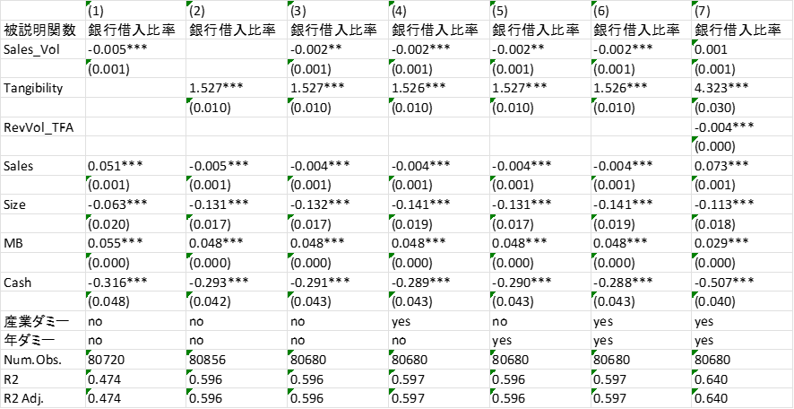

## この記事について

大学の講義で学んだ分析手法と一部コードを用いて、日本の上場企業における、銀行借入の決定要因について分析と考察を行いました。
使用データやRコードなどは、[こちら](https://github.com/shokubohcm/bankloans_factors)にアップロードしています。

## 前提

企業が銀行から融資を受ける際に重要になる要素として、1. 企業の返済能力、2. 担保があること などが挙げられる。

1. 企業の返済能力
企業の返済能力が低い場合、企業の債務不履行の状態に陥る可能性が高いため、銀行から融資を受けることが難しくなると考えられる。
2. 担保
企業が保有する有形固定資産（建物、土地、工場など）は、銀行融資において担保とし
て機能するため、有形固定資産を多く保有している企業ほど、銀行から借入できることが考えられる。

## 仮説

仮説1: 売上高のボラティリティが大きい企業ほど、返済能力が低いとみなされるため、銀行からの借入は少なくなる。
仮説2: 有形固定資産が多い企業ほど、有形固定資産が担保として機能するため、銀行からの借入は多くなる。

## データ

[日本の上場企業のデータ](https://github.com/shokubohcm/bankloans_factors)を使用した。（M&Aのデータはダミー）

## 分析

### データの読み込み、処理

```R
# パッケージの読込（dplyr, readr, openxlsx, modelsummary）
library(dplyr)
library(readr)
library(openxlsx)
library(modelsummary)

# データをインポートする
data = read_csv("all_2024_num.csv")

# 非金融業に属する企業と時価総額がある企業に限定する
source("label_20240929.R")

data = data |>
  filter(!grepl("銀行|保険|証券|その他|金融|-", g31))

data = data |>
  filter(!is.na(mv))
```

### 変数の作成

1. 銀行借入比率
$$ Debt = (短期借入金 + 1 年内返済の長期借入金 + 長期借入金)/総資産 $$

2. 売上高
$$ Sales = 売上高/総資産 $$

3. 売上高ボラティリティ
$$ Sales_Vol = 標準偏差 (Sales) $$

4. 有形固定資産
$$ Tangibility = 有形固定資産/総資産 $$

5. 企業規模
$$ Size = log(総資産) $$

6. 時価簿価比率
$$ MB = 時価総額/総資産 $$

7. 現金保有
$$ Cash = 現金保有/総資産 $$

```R
data = data |>
  mutate(
    b8 = as.numeric(b8),
    b11 = as.numeric(b11),
    b45 = as.numeric(b45),
    a40 = as.numeric(a40),
    d1 = as.numeric(d1),
    a40 = as.numeric(a40),
    a12 = as.numeric(a12),
    a5 = as.numeric(a5),
  )

# ここでb8,b11,b45に欠損値がある→合計のため0に変換

data = data |>
  mutate(b8=case_when(is.na(b8)~ 0,
                      TRUE ~ b8),
         b11=case_when(is.na(b11)~ 0,
                       TRUE ~ b11),
         b45=case_when(is.na(b45)~ 0,
                       TRUE ~ b45)
  )

# d1, a12, a5について、各企業の平均値で埋める
data = data |>
  group_by(fcode) |>
  mutate(
    d1 = coalesce(d1, mean(d1, na.rm = TRUE)),
    a12 = coalesce(a12, mean(a12, na.rm = TRUE)),
    a5 = coalesce(a5, mean(a5, na.rm = TRUE))
  ) |>
  ungroup()

data = data |>
  mutate(
    Debt = (b8 + b11 + b45) / a40,
    Sales = d1 / a40,
    Tangibility = a12 / a40,
    Size = log(a40),
    MB = mv / a40,
    Cash = a5 / a40
  )


data = data |>
  group_by(fcode) |>
  mutate(Sales_Vol=sd(Sales, na.rm = TRUE),
         Sales_Vol=round(Sales_Vol, digits = 3),) |>
  ungroup()
```

### 産業： 年ダミー変数を作成する

```R
data = data |>
  mutate(ind=as.factor(g31))

data = data |>
  mutate(year=NA_real_) 


for (i in 2000:2024) {
  data = data |>
    mutate(year=case_when(grepl(i, fy) ~ i,
                          TRUE ~ year)
    )
}


data = data |>
  mutate(year=as.factor(year))
```

### 売上高ボラティリティと有形固定資産の交差項を作成する

```R
data <- data %>%
  mutate(RevVol_TFA = Sales_Vol * Tangibility)
```

### 回帰分析

モデル１：
重要な説明変数：売上高ボラティリティ
コントロール変数：売上高、企業規模、時価簿価比率、現金保有
モデル２：
重要な説明変数：有形固定資産
コントロール変数：売上高、企業規模、時価簿価比率、現金保有
モデル３：
重要な説明変数：売上高ボラティリティ、有形固定資産
コントロール変数：売上高、企業規模、時価簿価比率、現金保有
モデル４：
重要な説明変数：売上高ボラティリティ、有形固定資産
コントロール変数：売上高、企業規模、時価簿価比率、現金保有、産業ダミーモデル５：
重要な説明変数：売上高ボラティリティ、有形固定資産
コントロール変数：売上高、企業規模、時価簿価比率、現金保有、年ダミー
モデル６：
重要な説明変数：売上高ボラティリティ、有形固定資産
コントロール変数：全てのコントロール変数
モデル７：
重要な説明変数：売上高ボラティリティ、有形固定資産、2 つの変数の交差項
コントロール変数：全てのコントロール変数

```R
est1 = lm(Debt ~ Sales_Vol + Sales + Size + MB + Cash, data=data)
est2 = lm(Debt ~ Tangibility + Sales + Size + MB + Cash, data=data)
est3 = lm(Debt ~ Sales_Vol + Tangibility + Sales + Size + MB + Cash, data=data)
est4 = lm(Debt ~ Sales_Vol + Tangibility + Sales + Size + MB + Cash + ind, data=data)
est5 = lm(Debt ~ Sales_Vol + Tangibility + Sales + Size + MB + Cash + year, data=data)
est6 = lm(Debt ~ Sales_Vol + Tangibility + Sales + Size + MB + Cash + ind + year, data=data)
est7 = lm(Debt ~ Sales_Vol + Tangibility + RevVol_TFA + Sales + Size + MB + Cash + ind + year, data=data)

est_inter = list(est1, est2, est3, est4, est5, est6, est7)

modelsummary(est_inter,
             fmt=3,
             stars = c("*"=0.1, "**"=0.05, "***"=0.01
             output = "est_inter(1).xlsx")
)
```

## 結果と考察


被説明変数はDebt（銀行借入比率）である。重要な変数としてSales_Vol, Tangibility, RevVol_TFAを用いている。コントロール変数はSales, Size, MB, Cashである。カッコは標準誤差を示している。*, **, ***は係数が統計的に10%, 5%, 1%水準で有意であることを示している。

### 仮説1

売上高のボラティリティが大きい企業ほど、返済能力が低いとみなされるため、銀行からの借入は少なくなる。
(1)〜(6)のモデルうち多くの列で Sales_Vol の係数が 負 かつ 統計的に有意になっている。
(7)のモデルでは Sales_Vol の係数が正になっているが、統計的に有意でない。
考察:
Sales_Vol の係数が安定的に「負」かつ有意になっている列が複数見られるということは、「売上高が変動しやすい企業ほど銀行借入比率が低い」傾向が統計的に示唆される。
したがって、仮説 1 (「売上高のボラティリティが高い→返済能力が低いとみなされ→銀行借入が抑えられる」) は大方サポートされていると考えられる。

### 仮説2

有形固定資産が多い企業ほど、有形固定資産が担保として機能するため、銀行からの借入は多くなる。
ほとんどの列で正の係数 (たとえば 1.526〜1.527 程度) かつ 1%水準や5%水準で有意 となっている。
係数そのものも大きめで、相当に安定したプラスの効果を示唆している。
列(7) では 4.323** となっており、これもプラス方向。
考察:
Tangibility がプラスかつ有意ということは、「有形固定資産が相対的に多い企業ほど、銀行借入比率が高い」傾向が確認できる。
これは 仮説 2 (「有形固定資産が担保として機能→銀行借入が増える」) を裏づける結果といえる。

## まとめ

本分析では、日本の上場企業における銀行借入の決定要因について、売上高のボラティリティと有形固定資産の影響を検証した。
結果として、売上高のボラティリティが大きい企業ほど、銀行借入比率が低い傾向が見られ、有形固定資産が多い企業ほど、銀行借入比率が高い傾向が見られた。
これらの結果は、企業の返済能力や担保の有無が銀行借入に影響を与えることを示唆している。

[Linkedin](https://www.linkedin.com/in/shokubohcm/)
いつでもFBお待ちしております。
