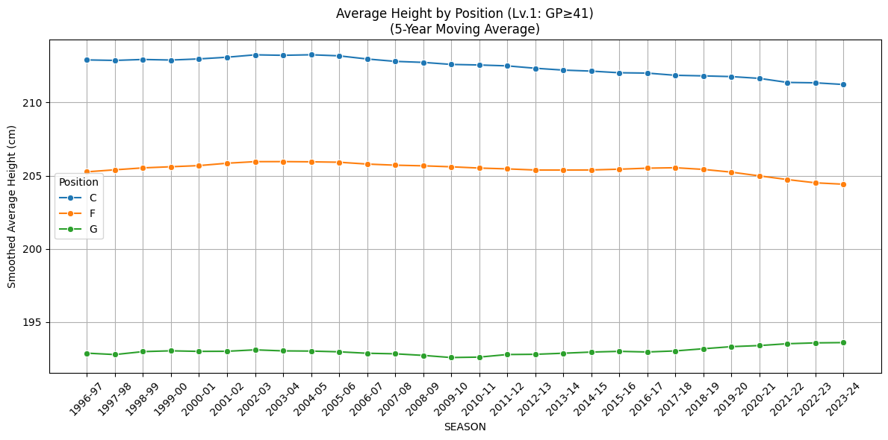
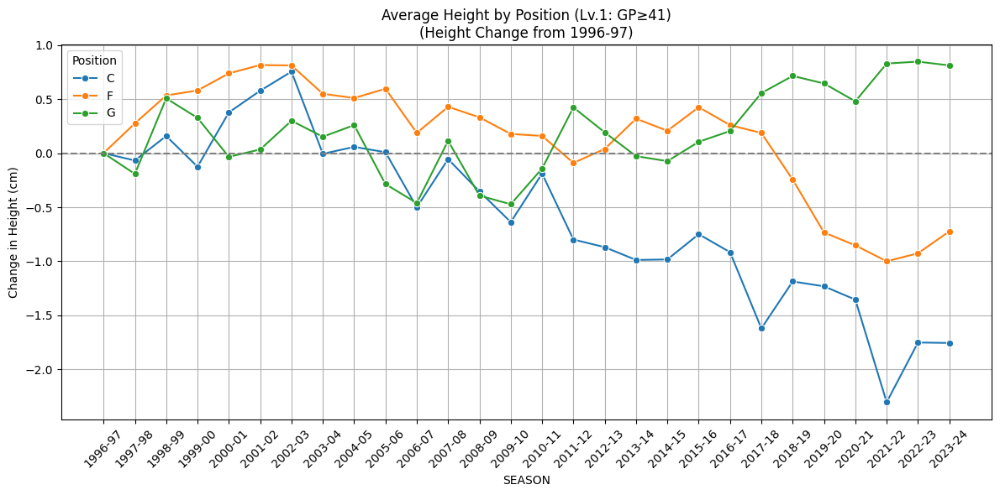
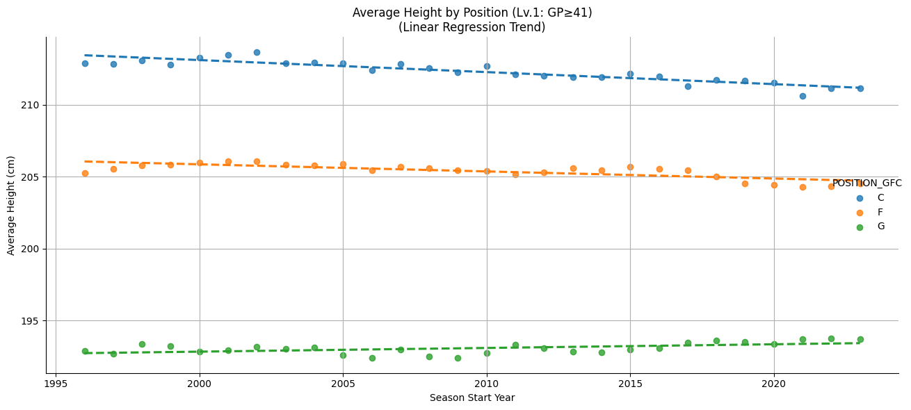
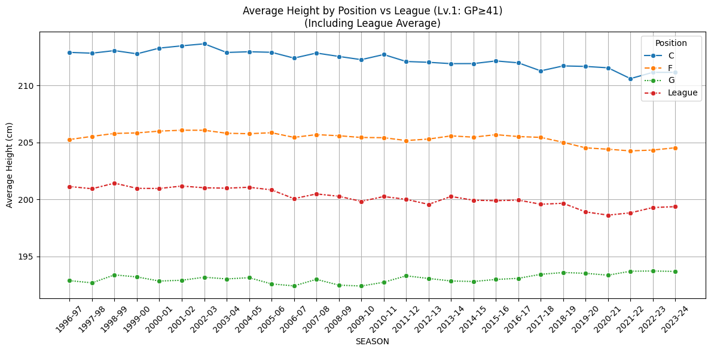
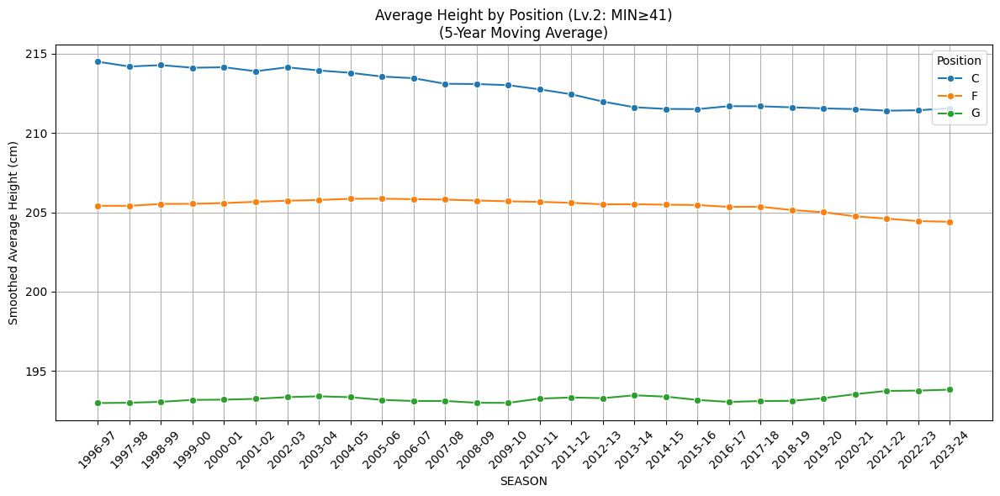
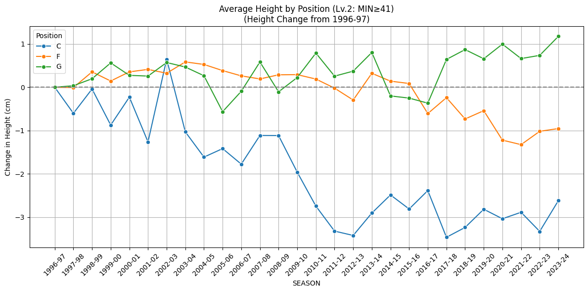
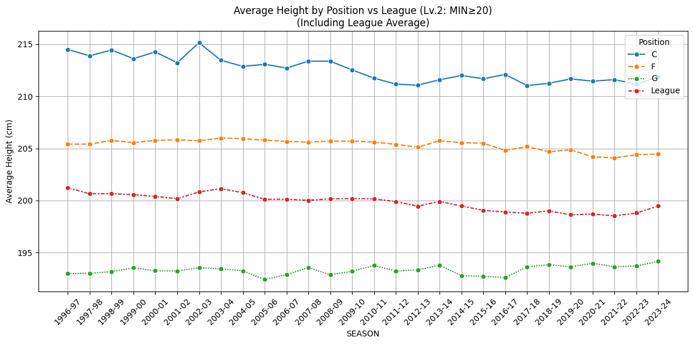
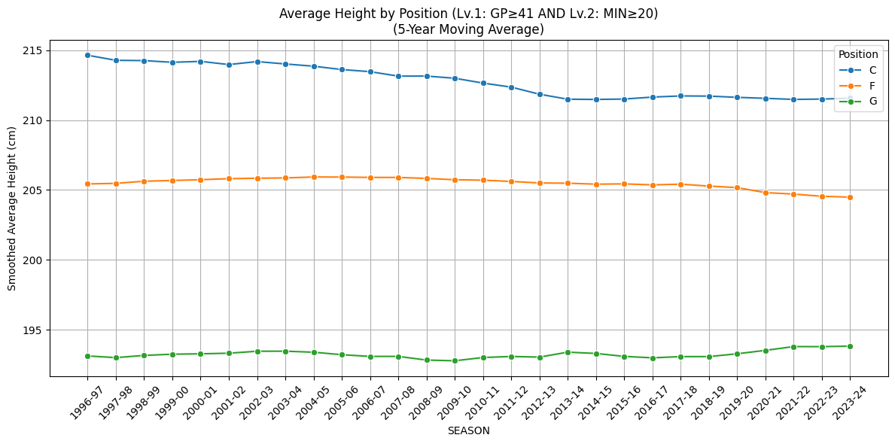
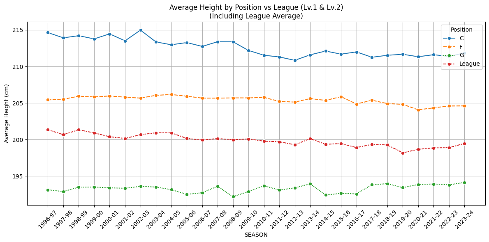

# How Have NBA Players' Heights Changed Over Time? [Data Analysis]

## Introduction

"Basketball is a tall man's game." While this saying has some truth to it, in recent years, player height in the NBA appears to be evolving—specifically by position.

Two noticeable trends are:

- **"Taller Point Guards (PGs)"**: In the 1980s and 1990s, prominent PGs like John Stockton and Isiah Thomas were around 185 cm (6 ft 1 in). In contrast, modern PGs like LaMelo Ball and Luka Doncic stand around 201 cm (6 ft 7 in).

- **"Shorter Centers (Cs)"**: The dominance of towering centers like Shaquille O'Neal and Patrick Ewing (210+ cm / 6 ft 11 in) in the 1990s has faded. Nowadays, teams like the Golden State Warriors utilize smaller Cs, such as Draymond Green, who is only about 200 cm (6 ft 6 in).

This study uses NBA data from the 1980s onward to investigate these positional height changes.

---

## Research Question (RQ)

I aim to answer the following question:

> **RQ: Have the heights of active NBA players changed over time by position?**
>
> - **Guards (G)** have become taller
> - **Centers (C)** have become shorter
> - **Forwards (F)** have stayed relatively consistent

Due to the fluidity of positional classification in the modern NBA, I grouped positions into three categories: Guard (G), Forward (F), and Center (C). A more detailed five-position breakdown is reserved for future work.

---

## Data and Methodology

- **Time Frame**: 1980–81 to 2023–24 seasons  
- **Player Filter**: Played at least **41 games per season** (roughly half of an NBA season)
- **Data Source**: Official NBA data using [nba_api](https://github.com/swar/nba_api)
- **Height Unit**: Recorded in centimeters (cm), but converted to feet/inches for reference
- **Position Classification**: Consolidated to G, F, or C based on the dominant position listed

---

### Defining "Active Players"

To focus on key contributors, I applied three filters:

- **Level 1 (Lv.1)**: Played 41+ games in a season
- **Level 2 (Lv.2)**: Averaged 20+ minutes per game
- **Lv.1 & Lv.2**: Players who satisfy both criteria

---

### Why Use Level 1 as the Primary Filter?

I used **Lv.1** for my main analysis for these reasons:

- **Games played** reflect season-long usage and consistency
- **Minutes played** can be more sensitive to team strategies and play styles
- **Stable sample size** across seasons when using game count

That said, all three filters were tested, and conclusions were consistent across them. Additional results are shown in the [Appendix](#appendix-results-using-other-filters-lv2-and-lv1--lv2) and on my [GitHub](https://github.com/shokubohcm/personal_blog/tree/main/nba_height_transition).

---

## Result 1: Average Height by Position (5-Year Moving Average)

I smoothed player height trends using 5-year moving averages:

**Key Findings**:
- **Guards (G)**: Gradual increase in height from the 1990s to 2020s
- **Centers (C)**: Slight decrease in height since the 2000s
- **Forwards (F)**: Remain relatively stable

These observations visually support our RQ.

---

## Result 2: Height Change Since 1996–97 (Baseline Year)

To better highlight the change, I used the 1996–97 season—the midpoint of the analysis period—as a baseline:

**Key Findings**:
- **Guards**: Height increased by about **+0.7 to +0.9 cm** (~0.3 in)
- **Centers**: Decreased by nearly **-2.0 cm** (~0.8 in)
- **Forwards**: Within a narrow range (±0.5 cm)

---

## Result 3: Are the Trends Statistically Significant?

I ran linear regression (year vs. average height) for each position:

| Position | Slope (cm/year) | p-value | Interpretation |
|----------|------------------|---------|----------------|
| Guard    | **+0.025**       | **0.03** | Statistically significant increase |
| Center   | **-0.088**       | **0.0000** | Statistically significant decrease |
| Forward  | +0.010           | 0.42    | Not significant |

This confirms that Gs and Cs experienced significant height shifts.

---

## Result 4: Comparison with League-Wide Average

I also compared positional averages with league-wide player height averages:

**Observations**:
- **Guards** are consistently shorter than league average, but are closing the gap
- **Centers** are consistently taller, but the gap is shrinking
- **Forwards** closely align with the league average and remain the most stable

Notably, the **league average height has decreased by ~1.7 cm (~0.7 in)** over 30 years, a statistically significant change (p < 0.001).

---

## Conclusion and Interpretation

| Position | Trend       | Statistical Significance | Notes |
|----------|-------------|---------------------------|-------|
| Guard    | Increasing  | ✅ Yes                     | Reflects emphasis on size and switch defense |
| Center   | Decreasing  | ✅ Yes                     | Rise of stretch-5s and mobile bigs |
| Forward  | Stable      | ❌ No                    | Consistently 200–205 cm (6 ft 7 in to 6 ft 9 in) |

League-wide height is also decreasing slightly but significantly.

---

## Data and Code

All code and data used for this analysis are available on GitHub:  

[GitHub Repository](https://github.com/shokubohcm/personal_blog/tree/main/nba_height_transition)

---

## Final Thoughts

The shift in NBA player profiles—from mobile bigs and 3-point shooting across all positions, to versatile defense—has made height trends a fascinating topic. With playoffs coming up, it will be exciting to see how these dynamics play out.

Feedback and comments welcome! 🙇‍♂️

[LinkedIn](https://www.linkedin.com/in/shokubohcm)

---

## Appendix: Results Using Other Filters (Lv.2 and Lv.1 & Lv.2)

### Lv.2: Players Averaging 20+ Minutes/Game

Click to view Lv.2 charts

  
  
  
  

| Position | Slope (cm/year) | p-value | Interpretation |
|----------|------------------|---------|----------------|
| Guard    | +0.026           | 0.01    | Significant upward trend |
| Center   | -0.089           | 0.0000  | Significant downward trend |
| Forward  | +0.009           | 0.40    | No significant change |

---

### Lv.1 & Lv.2: Players Meeting Both Criteria

Click to view Lv.1 & Lv.2 charts

  
  
  
  

| Position | Slope (cm/year) | p-value | Interpretation |
|----------|------------------|---------|----------------|
| Guard    | +0.029           | 0.007   | Statistically significant rise |
| Center   | -0.090           | 0.0000  | Statistically significant decline |
| Forward  | +0.007           | 0.47    | No meaningful change |

These additional filters reinforce the core hypothesis:  
> **Guards are getting taller, Centers are getting shorter, Forwards are unchanged.**

