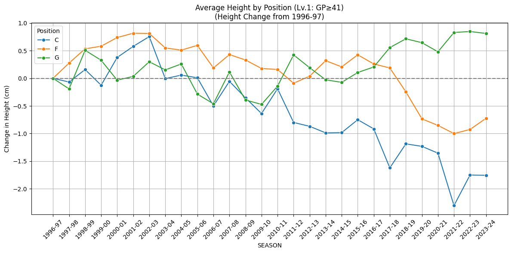
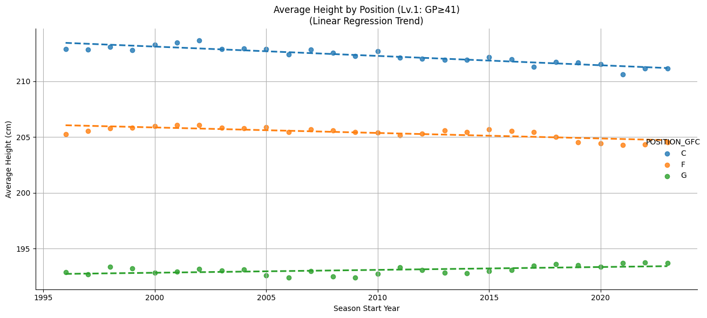
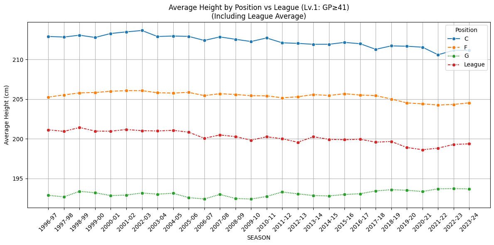
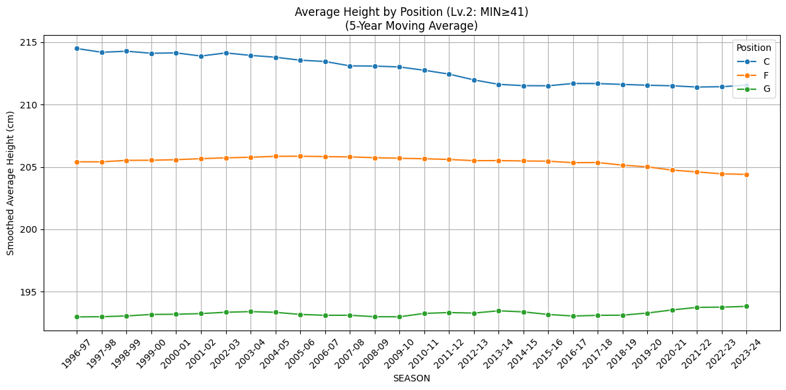
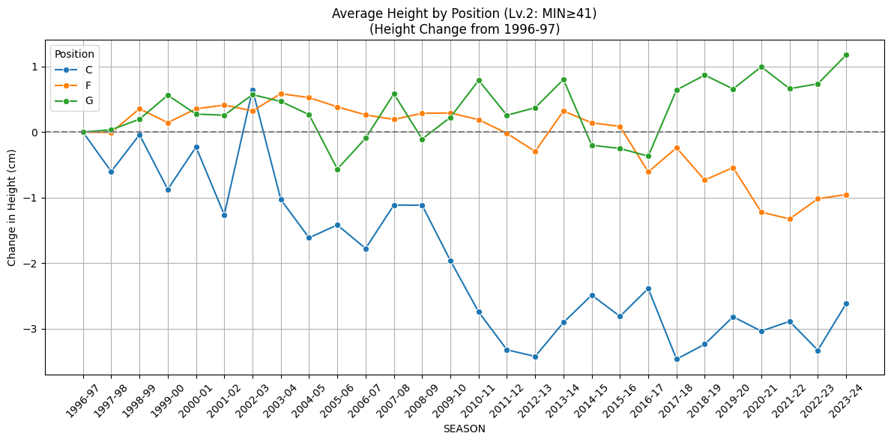
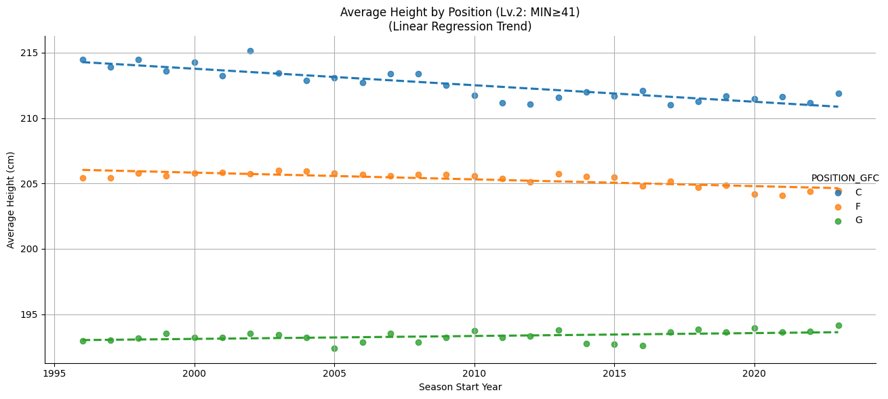
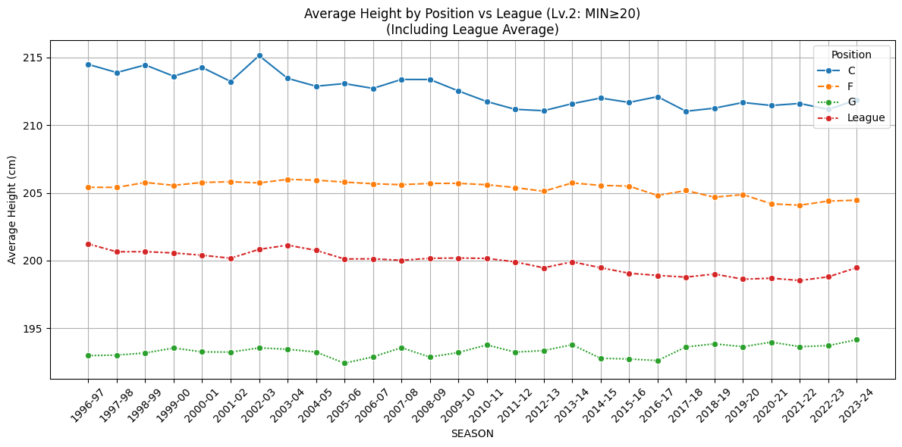
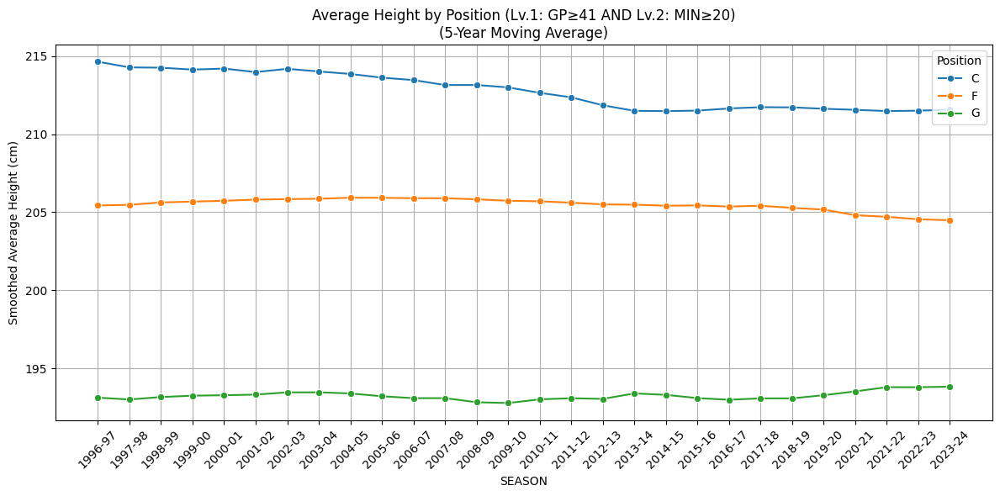
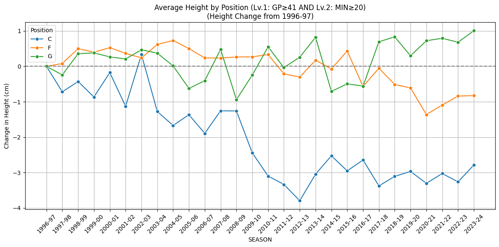
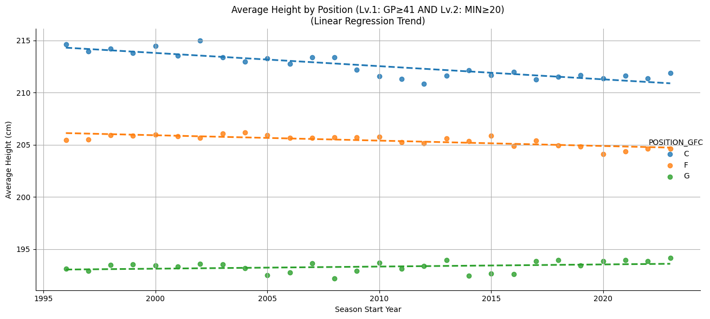

# NBA選手の身長はどのように変化してきたのか?【データ分析】

## はじめに

"バスケットボールは身長のスポーツ"とよく言われますが、NBAでは、近年ポジションごとに身長が変化してきたのではないかと感じています。
具体的には、"ポイントガード(PG)の大型化"と、"センター(C)の小型化"です。

- **"PGの大型化"**: 1980年代~1990年代の代表的なPGであるJohn StocktonやIsiah Thomasはいずれも185cm(6,1 feet)程ですが、近年の代表的なPGを上げると、Lamelo Ball、Luka Doncicともに201cm(6,6 feet)と、大型化しています。

- **"Cの小型化"**: Cの全盛期が終わり、1990年代にはShaquille O'neal、Patrick Ewingなど、210cm(6,9feet)より大きいCが幅を利かせていたのに比べ、近年では、Goldenstate WarriorsのDeath Lineupに代表されるように、小型のCをプレーさせるチームが増えました。実際、Draymond Greenなどの、200cm(6,6 feet)程のCもみるようになりました。

今回は、実際に1980年代以降のNBA選手のデータを下に、「ポジション別にみた身長の変化」に注目して分析を行いました。

---

## 仮説(リサーチクエスチョン)

本記事では、以下のリサーチクエスチョン(RQ)を設定し、検証を行いました。

> **RQ：NBAで活躍する選手の身長は、時代とともに以下のように変化しているのではないか？**
>
> - **ガード（G）**は徐々に高身長化している  
> - **センター（C）**はやや小型化している  
> - **フォワード（F）**はほとんど変化していない  

NBAにおいてポジションとは曖昧な概念であり、時と場合によって変わることもあるため、ポジションを5つに分けた際の分析は今回行っておりません。次回以降の課題としたいと思います。

---

## 分析対象と方法

- **対象期間**：1980–81シーズン ~ 2023–24シーズン  
- **対象選手**：各シーズンで **41試合以上出場**した選手（＝ローテーション入りの目安）  
- **データソース**：NBA公式API（[nba_api](https://github.com/swar/nba_api) を使用）  
- **身長の単位**：センチメートル（cm）に統一  
- **ポジションの分類**：Guard（G）、Forward（F）、Center（C）の3分類に統一（混合表記は最も優勢なポジションに割り振り）

---

### “活躍”の定義について

今回の分析では、NBAで活躍していた選手を客観的に抽出するために、以下の3つのフィルターを用意しました：

- **Lv.1：41試合以上に出場**（全82試合のちょうど半分。≒ローテーション入り選手）  
- **Lv.2：平均出場時間20分以上**（≒主力として起用されていた可能性）  
- **Lv.1 & Lv.2：上記の両方を満たす選手**

---

### なぜLv.1をメインに採用したのか

本記事では、まず最初に**「Lv.1（出場試合数）」をベースとした分析結果** を紹介しています。理由は以下の通りです：

- 出場試合数は**シーズン通しての起用度の安定性**を反映している
- 「20分以上」という基準はややチーム戦略に依存しやすく、**プレイスタイルの偏りに影響されやすい**
- 出場試合数で切ると、**年ごとのサンプルサイズが安定しやすい**

もちろん、Lv.2やLv.1&Lv.2の分析結果も別途検証しており、  
**最終的な結論は全てのフィルターで一貫して確認されています**。
分析結果は記事の[Appendix](#appendix他フィルターでの分析結果lv2--lv1--lv2)に載せており、[GitHub](https://github.com/shokubohcm/personal_blog/tree/main/nba_height_transition)からも確認できます。

## 結果①：ポジション別の平均身長推移（5年移動平均）

まずは、ガード・フォワード・センターの平均身長の推移を滑らかにするため、5年移動平均を取って可視化しました。

このグラフを見ると、以下の傾向が読み取れます：

- **G（ガード）**：1990年代~2020年代にかけて、**じわじわと高身長化**している
- **C（センター）**：2000年以降、**やや小型化傾向**
- **F（フォワード）**：ほぼ横ばいで、**変化が最も少ない**

→ 全体的に、RQに沿った傾向が視覚的に確認できる結果となりました。

---

## 結果②：1996–97年からの変化量で見る

先ほどのグラフでは絶対的な平均身長の推移を見ましたが、ここでは1996–97シーズン(分析期間の中間年)を基準に、**「どれだけ身長が変化したか（差分）」** をプロットしてみました。

このグラフから読み取れるのは：

- **G（ガード）** は、年を追うごとに**平均 +0.7〜+0.9cm ほど上昇**
- **C（センター）** は、**最大 -2.0cm 近く減少**
- **F（フォワード）** はほぼ±0.5cmの範囲で推移

このように、「どれだけ変化したか」に注目すると、GとCの変化が**より明確に**浮き彫りになります。

---

## 結果③：身長の変化は統計的に意味があるといえるか

**線形回帰分析（年 vs 平均身長）** を使って、各ポジションのトレンドを定量的に検証しました。

### 検定の結果（Lv.1のフィルター）：

| ポジション | 傾き（cm/年） | p値 | 結論 |
|------------|----------------|----------------|------|
| G（ガード）| **+0.025**      | **0.03**        | 有意に高身長化 |
| C（センター）| **-0.088**     | **0.0000**      | 有意に小型化 |
| F（フォワード）| +0.01        | 0.42            | 有意な変化なし |

特にガードとセンターについては、**偶然とは考えにくい変化** が統計的に確認されました。

---

## 結果④：リーグ全体の平均身長と比較する

最後に、G/F/Cというポジション分類だけでなく、**リーグ全体の平均身長**と比較することで、ポジションごとの特徴がより明確になるかを検証しました。

このグラフからは以下の点が読み取れます：

- **ガード（G）**の身長はリーグ全体の平均より**明確に低いが、近年やや近づいている**
- **センター（C）** の身長は全体平均より**一貫して高いが、差は縮まりつつある**
- **フォワード（F）** はほぼリーグ平均と一致して推移しており、**変化が最も安定**

さらに、リーグ平均そのものも**約30年間で -1.7cm 減少**していることが、統計検定によって有意に示されました（p < 0.001）。

---

## 考察と結論

今回の分析から、以下の結論が導かれました：

| ポジション | 傾向 | 統計的な有意性 | 解釈 |
|------------|------|----------------|------|
| G | 高くなっている | ✅ 有意 | スイッチディフェンスやサイズ重視のPG像の影響 |
| C | 小さくなっている | ✅ 有意 | ストレッチ5やモバイル型Cの登場など |
| F | 変化少ない | ❌ 有意でない | 安定的に200〜205cm程度で推移 |

また、リーグ全体としてもわずかではあるものの**身長の縮小傾向**が観測されました。

---

## データとコード

本分析に使用したデータやコードは以下のリポジトリで公開しています：

[GitHubリポジトリ](https://github.com/shokubohcm/personal_blog/tree/main/nba_height_transition)

---

## おわりに

モバイルビッグの登場や、ポジション関係なく3Pを打つ必要性、各プレーヤーが担うDFの役割の多角化など、いろんな要因が重なった結果だと思います。
これから始まるPlayoffsも楽しみです！！
自分が好きな分野での分析というのもあり、やっていてとても楽しかったです。

FBやご指摘等ありましたらよろしくお願いいたします🙇‍♂️

[LinkedIn](https://www.linkedin.com/in/shokubohcm)

---

## Appendix：他フィルターでの分析結果（Lv.2 / Lv.1 & Lv.2）

本記事の本文では、出場試合数ベースの **Lv.1（GP≧41）** をメインに扱いましたが、  
より厳しい条件のフィルターでも同様の傾向が確認されています。

---

### 🔹 Lv.2（平均出場時間 20分以上）

Lv.2分析結果図

- ガード（G）：**やや高身長化（+0.8cm程度）**  
- センター（C）：**明確な小型化（-1.7cm程度）**  
- フォワード（F）：**安定推移**  

線形回帰の傾き（cm/年）：

| ポジション | 傾き | p値 | 結論 |
|------------|------|-----|------|
| G          | +0.026 | 0.01 | 有意に上昇 |
| C          | -0.089 | 0.0000 | 有意に減少 |
| F          | +0.009 | 0.40 | 変化なし |

---

### 🔹 Lv.1 & Lv.2（試合数 + 出場時間 両方満たす）

Lv.1 & Lv.2分析結果図

- 最も「主力ローテ入りかつ出場時間が長い選手層」  
- ガードは+1.0cm、センターは-2.0cm程度の変化が確認される

線形回帰の傾き（cm/年）：

| ポジション | 傾き | p値 | 結論 |
|------------|------|-----|------|
| G          | +0.029 | 0.007 | 有意に上昇 |
| C          | -0.090 | 0.0000 | 有意に減少 |
| F          | +0.007 | 0.47 | 変化なし |

---

これらの結果からも、RQとして設定した

> **「Gは高くなり、Cは小さくなり、Fは変わらない」**

という傾向は、**どの活躍フィルターでも一貫して確認されている**ことがわかります。
