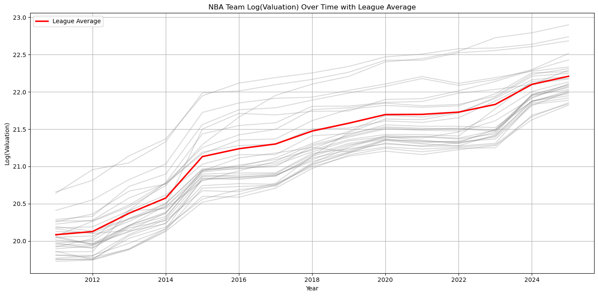
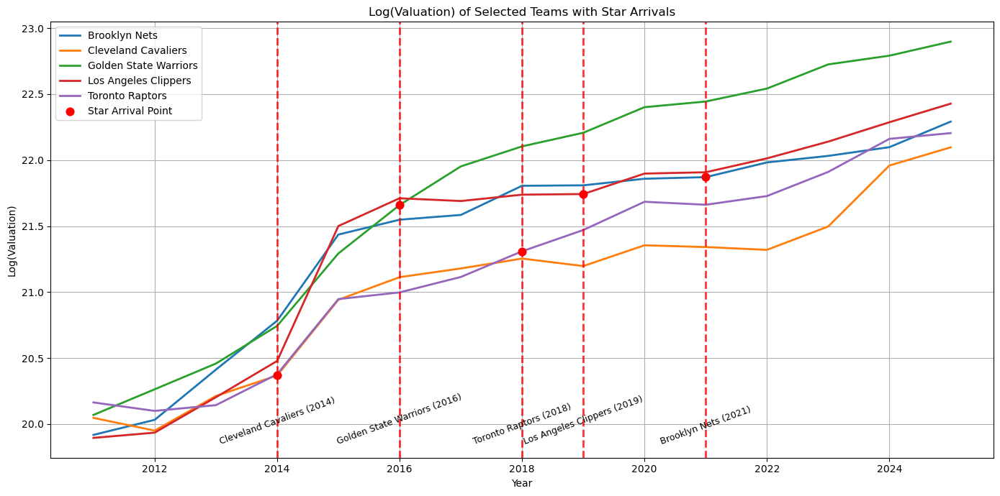
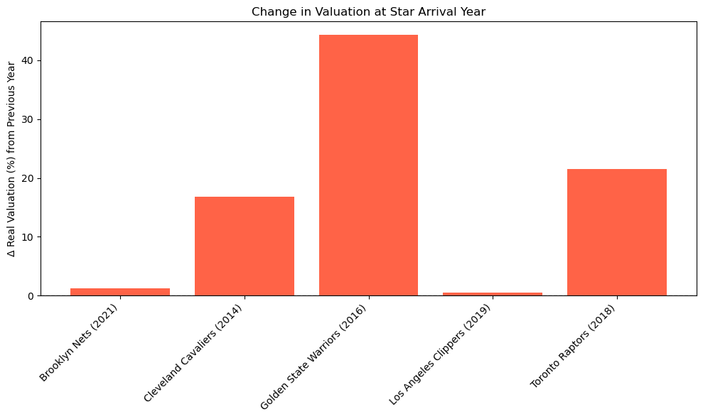
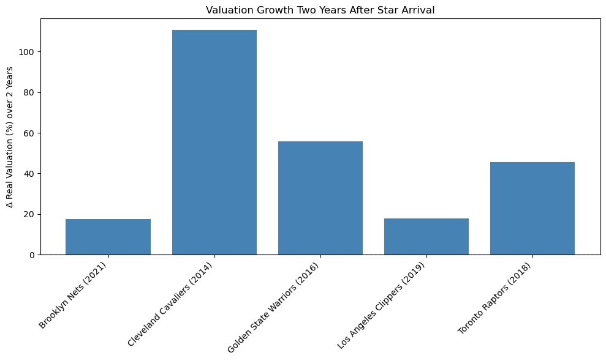

# Do Star Players Move the “Stock Price” of NBA Teams? ~(1/3) Macro Perspective – Analyzing Team Valuations Across the League~

## 1. Introduction: Do stars bring not only wins but also money?

Every NBA fan loves to debate how a team’s performance might change with the arrival of a superstar. Predicting wins and losses always gets us fired up.

But for those of us studying business and finance, there’s another question that naturally comes to mind:

“How much does a superstar impact a team’s financial standing?”

When players like LeBron James or Kevin Durant change teams, the media often highlights how their impact goes beyond the court—affecting the franchise’s valuation, essentially its “stock price.”

In this article, I aim to examine this idea using real data. Leveraging team valuation figures published by Forbes from 2011 to 2025, I explore whether the arrival of a star player actually served as a catalyst for boosting franchise value.

This is the first in a three-part series. In this (1/3) Macro Perspective, I start by examining league-wide trends. The next article, (2/3) Case Studies, will dive into individual star signings, and the final part, (3/3) Analytical Perspective, will attempt a basic causal inference.

## 2. How We Measured “Value”

To ensure the analysis is as reliable as possible, I applied a few preprocessing steps to the data:

Data source: Forbes’ NBA franchise valuations from 2011 to 2025.

Inflation adjustment: A dollar in 2011 isn’t worth the same as a dollar in 2025. I used the Consumer Price Index (CPI) to adjust for inflation and make valuations comparable in real terms.

Log transformation: Team sizes vary greatly, which makes absolute valuation comparisons misleading. By using the logarithm of valuations, I could focus on rates of change—making it easier to compare small and large franchises.

All the data and code are available on [GitHub](https://github.com/shokubohcm/personal_blog/tree/main/nba_teamValuation). Feel free to share feedback.

## 3. First, is the NBA in a “valuation bubble”?

Before zooming in on individual teams, let’s take a look at the league-wide trend.

(Figure 1) Valuation trends of all teams and the league average

As the chart shows, the entire league is rising steadily. This growth is largely driven by massive TV rights deals and global expansion—some might call it the “NBA bubble.”

In other words, most teams are seeing their values rise simply by being part of the league. This tailwind must be considered; otherwise, we risk overestimating the effect of star players. We’ll return to this point in the discussion section.

## 4. Main Question: Do Star Players Really Create Value?

Now let’s get to the core question: Did the valuation of teams with new superstar signings increase beyond the league average?

(Figure 2) Valuation trends of teams with major star signings

This chart isolates five representative teams that landed major stars. The red dots indicate the year each player arrived. As you can see, in many cases the slope of the line steepens around that point.

But did the effect show up right away—or did it take time?

### Short-term Impact: Change in Year 1

(Figure 3) Year-on-year change in valuation at time of signing

Looking at the first year after the signing, results were mixed:

**Immediate Impact Group:**

- Warriors (2016, KD): +44%
- Raptors (2018, Kawhi): +21%
- Cavaliers (2014, LeBron): +17%

These are what you might call “superstar windfalls.” The Warriors’ jump is especially striking.

**Slow Burn Group:**

- Nets (2021, Harden): +1%
- Clippers (2019, Kawhi & PG): +0.4%

Despite bringing in multiple stars, these teams saw almost no bump in the first year—a surprising result.

### Medium-term Impact: Change After 2 Years

Let’s take a longer view. How did valuations look two years after the star arrived?

(Figure 4) 2-year growth in team valuation after signing

What stands out most is the Cavaliers: two years after LeBron returned, the team’s valuation had more than doubled (+110%).

While the Warriors had the biggest short-term jump, the Cavs delivered long-term growth.

Interestingly, the Nets (+17%) and Clippers (+18%)—which showed little movement in year one—ended up with solid gains two years later. These cases may demonstrate a “slow burn” effect.

## 5. Discussion: Was the Growth Truly Thanks to the Star?
So far, the data seems to support the idea that a superstar signing boosts a team’s valuation—at least in the short or medium term. LeBron’s return to small-market Cleveland, in particular, is said to have lifted not only the team but also the local economy.

However, can we really attribute the valuation jump solely to the player?

- Correlation vs. causation: Was it “because the star joined, the value increased”? Or did the star choose a team already poised for growth—say, with a new arena on the way? For example, much of the Warriors’ valuation growth likely stemmed from the opening of Chase Center.

- Riding the tailwind: As we saw earlier, the entire NBA is growing. A big portion of any valuation increase may simply reflect league-wide momentum. To isolate the star’s true contribution, we need to adjust for this.

- Intangible assets: A team’s valuation reflects not just current earnings but future expectations. A superstar increases ticket and merchandise revenue—but perhaps more importantly, boosts brand value, an intangible asset. This can enhance the team’s leverage in future sponsorships and media deals, causing valuation to rise in anticipation of future cash flows.

## 6. What’s Next: Case Studies and Statistical Analysis

This macro overview revealed how valuations behave across the league and around major signings. While the magnitude varies, it seems fair to say that star players bring “something valuable” to the table.

That said, each of these data points has its own story behind it.

In the next article, (2/3) Case Studies, I’ll dive into individual examples—like LeBron and KD—and unpack what made their signings so impactful.

Then, in (3/3) Analytical Perspective, I’ll try to statistically control for “other factors” using a simplified Difference-in-Differences approach, in an effort to get closer to the pure effect of star signings.

Thank you for reading!
I’d love to hear your thoughts—whether it’s feedback, critique, or alternative interpretations. Please feel free to connect with me on [LinkedIn](https://www.linkedin.com/in/shokubohcm/) or leave a comment!
