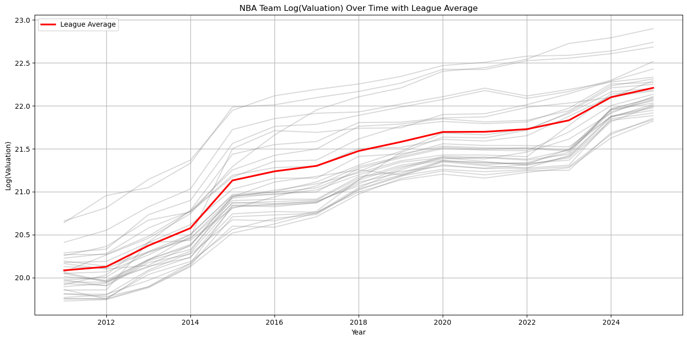
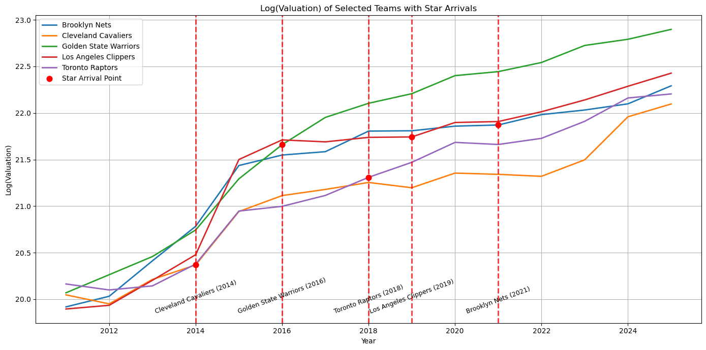
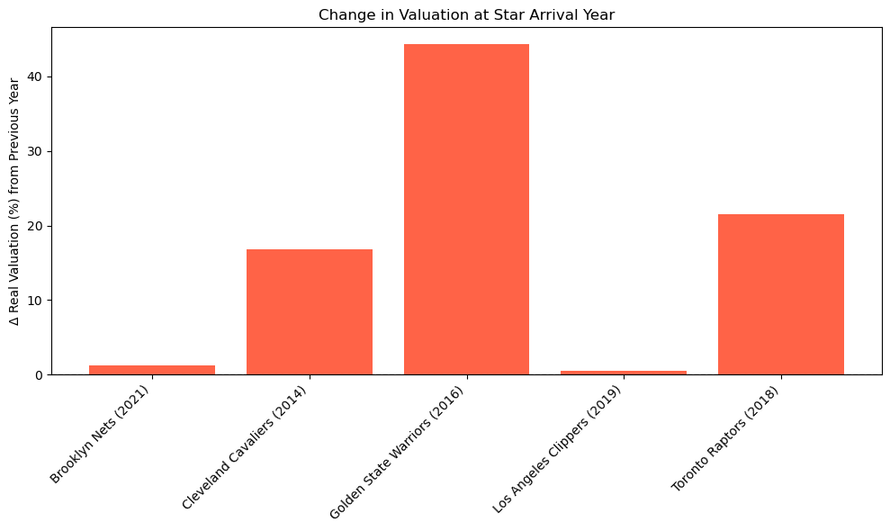
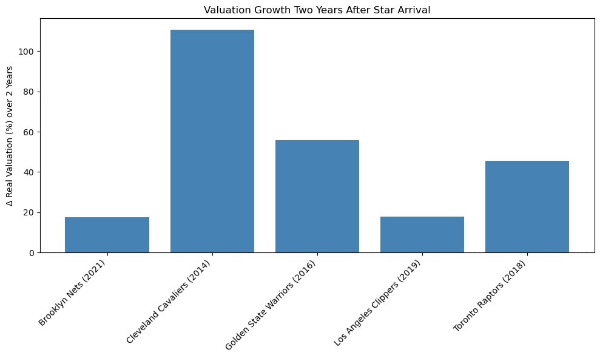

# スター選手はチームの“株価”を動かすのか? 〜NBAチームの企業価値分析: (1/3) マクロ編〜

## 1. はじめに: スターは“勝利”だけでなく“お金”も連れてくるのか?

NBAファンなら誰しもが議論する「あのスターが来たら、チームはどれだけ強くなるのか?」。勝敗予想は、いつだって僕らを熱くさせます。

でも、ビジネスやファイナンスを学ぶ僕たちが気になるのは、もう一つの問いではないでしょうか。

「あのスターが来たら、チームの“フトコロ”はどれだけ潤うのか?」

レブロン・ジェームズやケビン・デュラントのようなスーパースターの移籍は、単なる戦力補強に留まらず、チームの「企業価値(Valuation)」、いわば“株価”を大きく動かすと言われています。

本記事では、この仮説をデータで検証してみたいと思います。Forbesが発表している2011年から2025年までのNBAチームの企業価値データを使い、スター選手の移籍が本当に価値向上の起爆剤になったのか、そのリアルな動きを探っていきます。

この記事は三部構成の「(1/3) マクロ編」です。まずは大きな視点から全体像を掴み、次回以降の「(2/3) ケース編」で個別の移籍事例を、「(3/3) 分析編」でできる限りの因果関係の分析へと進んでいきます。

## 2. どうやって「価値」を測るか

今回の分析の信頼性を高めるために、データにいくつかの下ごしらえをしました。

データソース: Forbes発表のNBAチームValuation(2011〜2025年)
インフレ調整: 昔の1ドルと今の1ドルは価値が違います。そこで、CPI(消費者物価指数)を用いてインフレの影響を取り除き、なるべく「実質的」な価値で比較できるようにしました。
対数(Log)変換: チームの規模が違うと、評価額の「額」の差は大きくなりすぎて比較しづらいです。そこで、評価額の対数を取ることで、変化の「率」に注目し、規模の違うチーム同士でも比較しやすくしています。

この辺りは、コードを公開しているので、[こちら](https://github.com/shokubohcm/personal_blog/tree/main/nba_teamValuation)を参照していただけらばと思います。FBお待ちしております。

## 3. そもそもNBAは“バブル”?リーグ全体が右肩上がり

個別のチームを見る前に、まずはNBA市場全体のトレンドを確認しましょう。

(図1) NBA全チームの評価額推移とリーグ平均

このグラフは、全チームの評価額(薄いグレーの線)とリーグ全体の平均(赤い線)の推移です。一目瞭然、リーグ全体が力強く右肩上がりであることがわかります。これは、巨額の放映権契約などに支えられた、いわば「NBAバブル」とも言える状況です。

つまり、どのチームの価値も多かれ少なかれ上がっているのが大前提。この全体的な“追い風”を考慮しないと、スター選手の効果を過大評価してしまうかもしれません。この点は、後の考察で重要になります。

## 4. 本題: スター選手の「価値創造力」は本物か?

では、いよいよ本題です。スター選手が移籍したチームの評価額は、リーグの追い風以上に上昇したのでしょうか。

(図2) スター移籍があったチームの評価額推移

このグラフは、代表的な移籍事例があった5チームの評価額の推移を抜き出したものです。赤い点が、スター選手がやってきた年を示しています。どのチームも、赤い点のあたりからグラフの角度が急になっているように見えますね。

では、その効果は「即効性」があったのでしょうか、それとも「遅効性」だったのでしょうか?

### 短期的なインパクト: 加入1年目の変化

(図3) スター加入年の前年比評価額変化率

移籍直後のインパクトを見ると、明暗が分かれました。

【即効性アリ組】

- ウォリアーズ (2016, KD加入): +44%
- ラプターズ (2018, カワイ加入): +21%
- キャバリアーズ (2014, レブロン復帰): +17%

まさに「スター特需」。特にウォリアーズの伸びは驚異的です。

【即効性は…?組】

- ネッツ (2021, ハーデン加入): +1%
- クリッパーズ (2019, カワイ&PG加入): +0.4%

スターを2枚、3枚と揃えたにもかかわらず、初年度の評価額へのインパクトはほぼゼロ。これは少し意外な結果です。

### 中期的なインパクト: 2年後の変化

では、少し長い目で見るとどうでしょうか。移籍から2年後の評価額が、移籍前からどれだけ伸びたかを見てみましょう。

(図4) 移籍2年後の評価額成長率

ここで目立つのがキャバリアーズです。レブロン復帰から2年で、チームの価値は2倍以上 (+110%) になっています。即効性ではウォリアーズに劣るものの、じわじわと、しかし絶大な効果をもたらしたことがわかります。

そして、加入直後は鳴かず飛ばずだったネッツ (+17%) やクリッパーズ (+18%) も、2年後にはしっかりと価値を伸ばしています。「遅効性」のスター効果があったと言えそうです。

## 5. 考察: この価値上昇は、本当に「スターのおかげ」か?

ここまでのデータを見ると、「スター選手の加入は、短期的または中期的にチームの企業価値を押し上げる効果がある」と言えそうです。特に、レブロンがクリーブランドのようなスモールマーケットのチームに戻った時のインパクトは、チームの枠を超え、街全体の経済にも影響を与えたと言われています。

しかし、この価値上昇は、本当に「スター選手だけ」の功績なのでしょうか?

- 相関と因果の罠: まず、「スターが来たから価値が上がった」のか、それとも「価値が上がりそうなポテンシャルのあるチーム(新アリーナ建設計画など)にスターが来た」のか、という鶏と卵の問題は常に付きまといます。実際、GSWの大幅な価値上昇はChase Centerオープンが大きく関係していそうです、、、
- 追い風との切り分け: 先ほど見たように、NBA全体が成長しています。今回観測された価値上昇分には、このリーグ全体の追い風がかなり含まれているはずです。スターの“純粋な”貢献度を測るには、この影響を取り除く必要があります。
- 無形資産の価値: 企業価値(Valuation)の増加は、将来のキャッシュフローが増えるだろうという「期待感」の表れです。スター選手の加入は、チケット収入やグッズ売上といった直接的な収益だけでなく、チームの**「ブランド価値」という無形資産**を大きく押し上げます。この無形資産の増加が、将来のスポンサー契約や放映権交渉で有利に働くことを見越して、評価額が先行して上昇している、と解釈することもできます。

## 6. これから: ケーススタディと統計分析で、さらに深掘る

今回はマクロ編として、データから見えてくる大きなトレンドを描いてみました。スター選手は、即効性の差こそあれ、チームの価値を高める「何か」を持っていることは間違いなさそうです。

しかし、これらの数字は個別の事情から生まれたものです。
次回の**『(2/3) ケース編』**では、レブロンやKDといった個別の移籍事例にフォーカスし、なぜ彼らの移籍がこれほどのインパクトをもたらしたのか、その背景を深掘りし、

**『(3/3) 分析編』**では、今回挙げたような「他の要因」の影響を、文系学部生なりに統計的にコントロールすることに挑戦し、スター選手の“純粋な”効果に迫ってみたいと思います。

ご拝読いただきありがとうございました!
この記事に関するご意見や、「こういう別の見方もできるのでは」といった分析へのツッコミなど、ぜひ[LinkedIn](https://www.linkedin.com/in/shokubohcm/)やコメントでお聞かせください! FBお待ちしております!!
