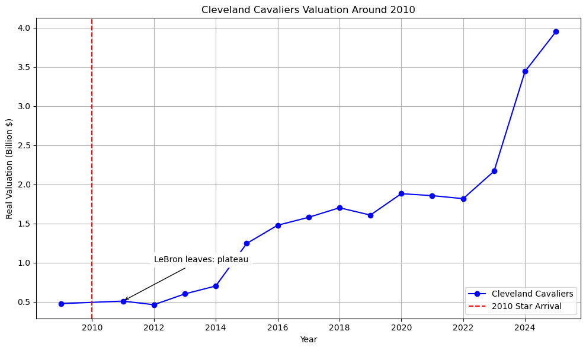
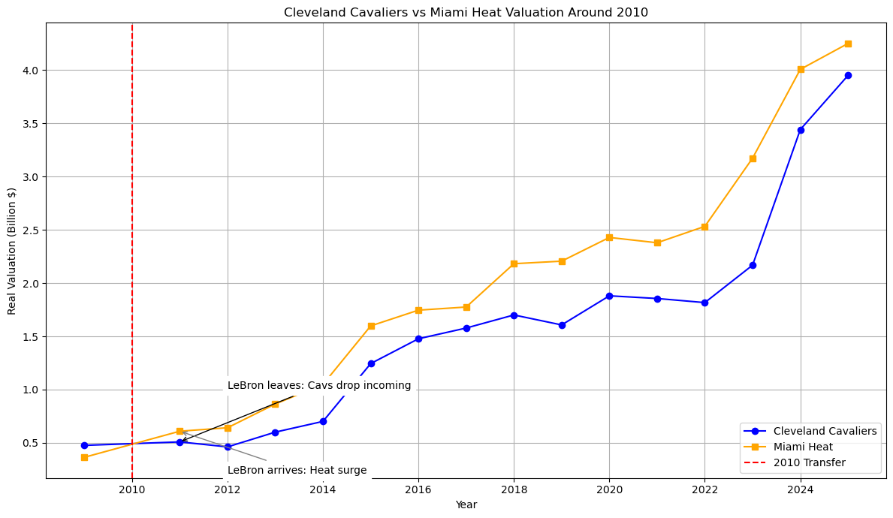
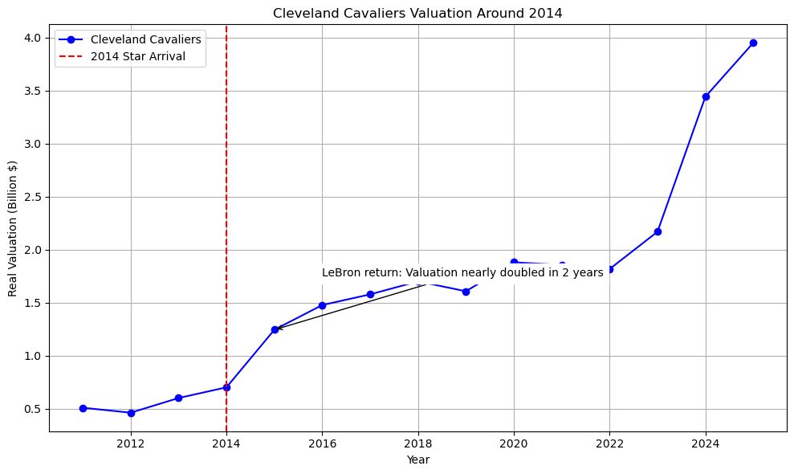
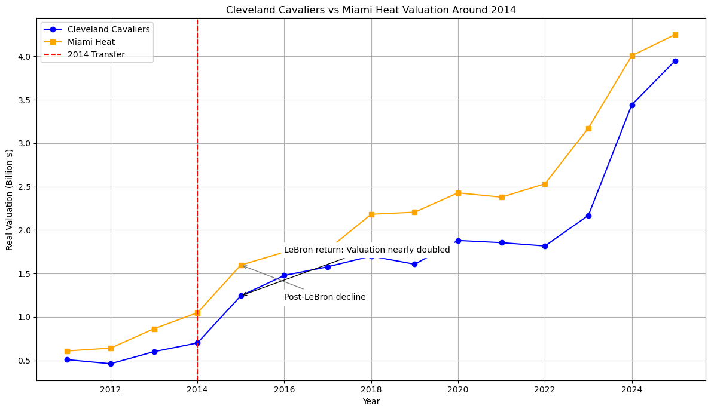
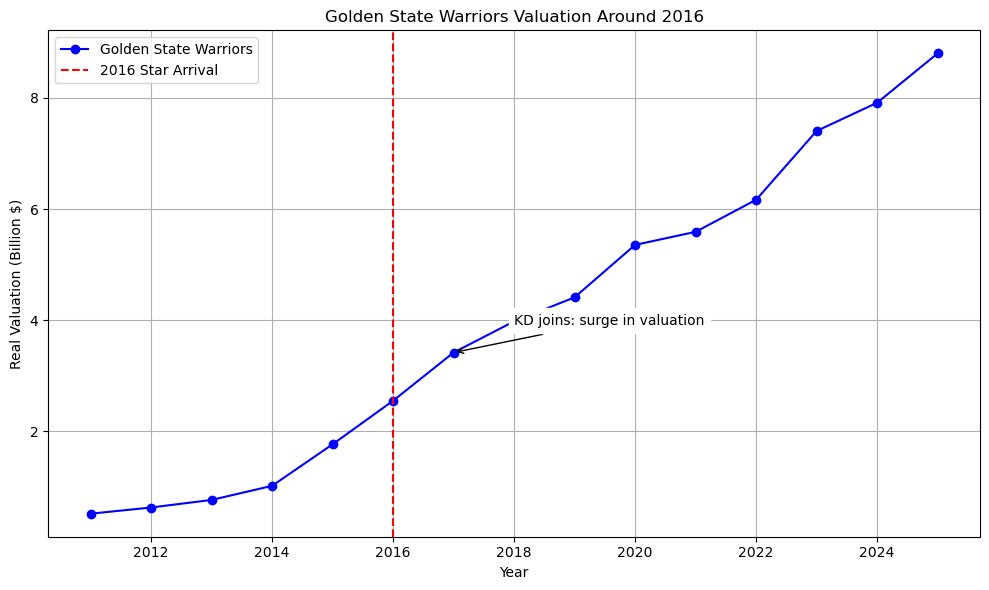
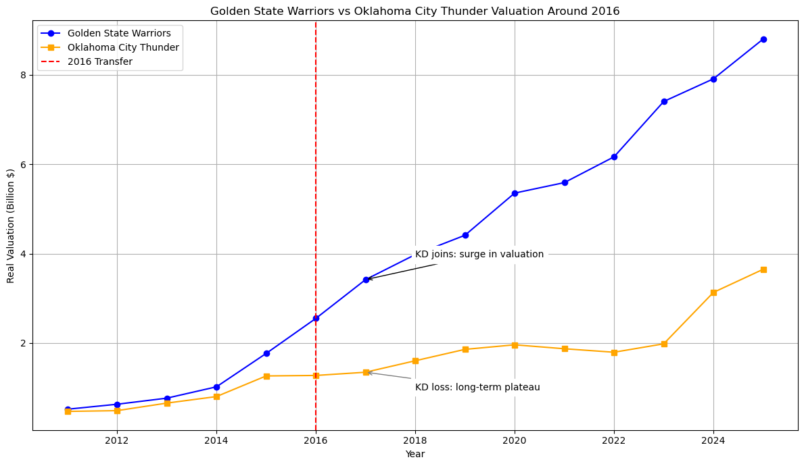
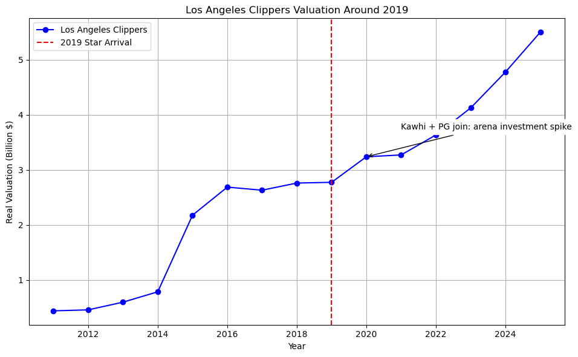
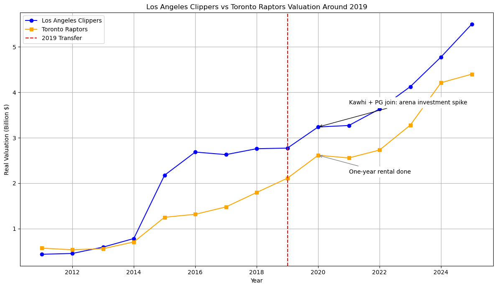
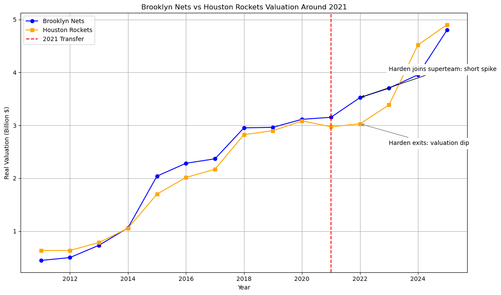

# Do Star Players Move the “Stock Price” of NBA Teams? ~ (2/3) Case Studies – 5 Trades that Shook the NBA ~

## 0. Introduction: "So, What Actually Happened to the Team's Value?"

Star players bring more than just wins to a team. Their every move can shift the league's balance of power and move huge amounts of money.

In the previous post, [(1/3) The Big Picture](https://medium.com/@shokubohcm/do-star-players-move-the-stock-price-of-nba-teams-13166b3da4e7), we looked at the data and saw how a team's valuation tends to jump right when a star player transfers.

So, what actually happened to a team's value behind the scenes of those historic trades?

In this second part of the series, "The Case Studies," we'll pick five iconic trades from NBA history and take a look, one by one, at how the valuations of the teams involved changed, complete with graphs.

All the data and code are available on [GitHub](https://github.com/shokubohcm/personal_blog/tree/main/nba_teamValuation).

## 1. Case 1: 2010, LeBron James → Miami Heat

"I'm going to take my talents to South Beach."

Every basketball fan knows "The Decision." When LeBron James left his hometown team in Cleveland for the Miami Heat, it became a social phenomenon, not just a player changing teams.

(Figure 1) Cleveland Cavaliers' Valuation Trend After LeBron's Departure

After LeBron left, the Cavaliers' (see above) valuation growth clearly stagnated. The cost of losing the player who was both the face of the franchise and its economic pillar was immense.

(Figure 2) Valuation Comparison: Cavaliers vs. Heat Around the 2010 Transfer

On the other hand, the Heat's valuation shot up immediately after acquiring LeBron (see above). This shows that before the team even won a championship ring, the market had immediately priced in the value of "LeBron James" as an asset. It was a moment where the star's value itself was literally priced in.

## 2. Case 2: 2014, LeBron James → Cleveland Cavaliers (The Return)

Four years later, "The King" returned home to Cleveland. The impact of this move on the Cavaliers was far greater than his departure.

(Figure 3) Cleveland Cavaliers' Valuation Trend After LeBron's Return

The graph tells the whole story. After the red line in 2014, the Cavaliers' valuation exploded, nearly doubling in just two years. This is a classic example not of value increasing because they won, but of intense expectation of future wins driving up value beforehand.

(Figure 4) Valuation Comparison: Cavaliers vs. Heat Around the 2014 Transfer

When you put the valuation changes of the Heat and the Cavs side-by-side, you can see a seesaw-like movement. It's a powerful reminder of the incredible impact a single player's move can have on the destinies of two different teams.

## 3. Case 3: 2016, Kevin Durant → Golden State Warriors

An MVP-level player, Kevin Durant, joining the strongest team in the league right after their historic 73-9 season... This "forbidden move," you could say, elevated the Warriors from just a powerhouse to a "dynasty."

(Figure 5) Golden State Warriors' Valuation Trend After Kevin Durant's Arrival

The Warriors' valuation, which was already on a high growth track, started climbing at an even steeper angle after Durant joined. Expanded sponsorship deals, anticipation for a new arena, and the brand image of being "the greatest team ever"—all these positive factors pushed the valuation up.

(Figure 6) Valuation Comparison: Warriors vs. Thunder Around the 2016 Transfer

Meanwhile, the Thunder, who lost Durant, saw their valuation growth stagnate for some time afterward. As the Warriors established their "dynasty brand," the difficulty of losing a franchise star was brought into sharp relief.

## 4. Case 4: 2019, Kawhi Leonard → Los Angeles Clippers

After leading the Raptors to a miraculous first-ever championship, Kawhi Leonard, along with Paul George, headed to the Clippers. For the Clippers, long seen as the Lakers' "little brother," this was a big gamble to fundamentally change their brand image.

(Figure 7) Los Angeles Clippers' Valuation Trend After Kawhi Leonard & Paul George Joined

As we saw in the "Big Picture" post, the immediate increase in valuation was limited. However, this move should be seen as part of a long-term investment in their brand, linked to their new arena plans. Indeed, the Clippers' value has steadily climbed since. This is an example of "future potential" shaping value more than immediate wins.

(Figure 8) Valuation Comparison: Clippers vs. Raptors Around the 2019 Transfer

In contrast, the Raptors' valuation growth slowed after Kawhi left. The historic championship brought priceless value, but the fact that it was a "one-year rental" is also reflected in the valuation trend.

## 5. Case 5: 2021, James Harden → Brooklyn Nets

In addition to Kevin Durant and Kyrie Irving, James Harden made a shocking move to join them. The moment "the greatest offensive trio ever" was born in Brooklyn, expectations hit an all-time high.

(Figure 9) Brooklyn Nets' Valuation Trend After James Harden Joined

Looking at the graph, you can see the valuation temporarily spikes at the time the Big 3 was formed. It's clear just how much the market was anticipating from this "superteam."

(Figure 10) Valuation Comparison: Nets vs. Rockets Around the 2021 Transfer

But this dream team didn't last long. Harden was traded after just one year, and the team was dismantled. As the graph shows, the Nets' valuation increase was short-lived. This serves as a cautionary tale that simply gathering stars doesn't lead to sustainable value growth, and highlights how crucial "team success" really is.

## 6. Cross-Case Analysis: Common Threads and Exceptions from the 5 Cases

From these case studies, a few patterns emerge.

- Common Thread: "Hype" Drives Value First

In every case, the team's valuation moved significantly before they actually lifted a championship trophy. This is because the "expectation" of future cash flow—from increased media exposure, sponsorship deals, and advance ticket sales—gets priced into the valuation. It felt a lot like a startup raising funds based on future potential.

- Exceptions and Caveats: The Sustainability Challenge

On the other hand, as the Nets' case shows, acquiring a star doesn't always lead to a sustained increase in value. Furthermore, teams like the Warriors, with the "resilience" to maintain high value even after a star leaves, are rare. The team's culture and management foundation are crucial factors that determine its true, underlying value.

## 7. Next Time: Investigating if This Effect is "Real"

So far in this series, we've looked at the impact of star player transfers on team valuation from both a big-picture perspective and through specific cases.

- [Previous Post (The Big Picture)](https://medium.com/@shokubohcm/do-star-players-move-the-stock-price-of-nba-teams-13166b3da4e7): Got a rough grasp of the overall trends with numbers.
- This Post (The Case Studies) (coming soon...): Looked at the "stories" of iconic transfers alongside the data.
But personally, I'm still stuck on one question: "Is the observed increase in value really just because of the star player?"

If we remove the effect of the league's overall growth (the rising tide) and other factors, what is the star player's "pure contribution" to the team's value?

I have no real background in causal inference, so this won't be a strictly rigorous study, but in the final part, "(3/3) The Analysis (coming soon...)", I want to use the Difference-in-Differences (DiD) method to try and reveal the "true effect" of a star transfer on valuation with objective numbers, as much as possible.

Thanks for reading!
I'd love to hear your thoughts on this article or any critiques of the analysis, "Hey, have you thought about it this way?" Please feel free to reach out on [LinkedIn](https://www.linkedin.com/in/shokubohcm/) or in the comments! Always open to feedback!!
