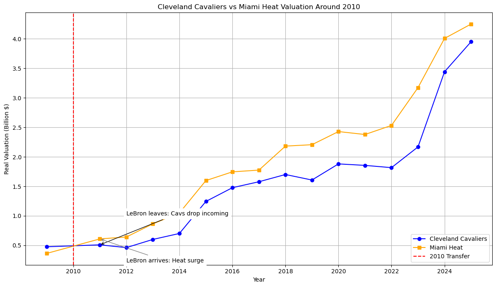
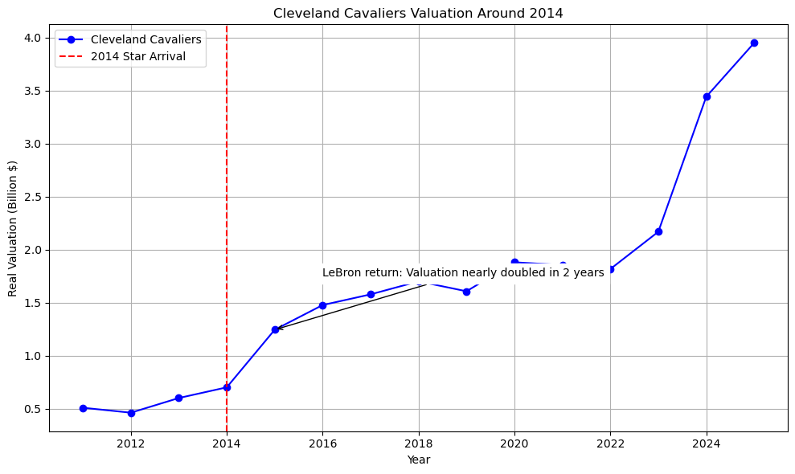
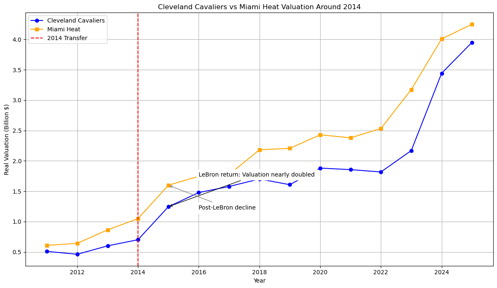
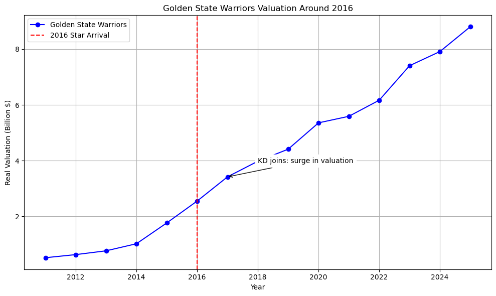
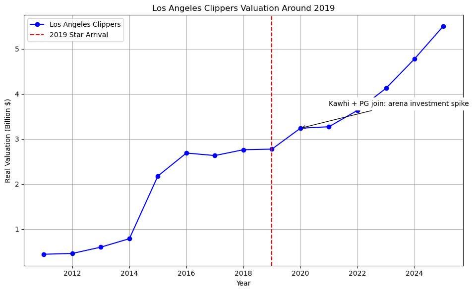

# スター選手はチームの“株価”を動かすのか?～NBAを動かした5つの移籍: (2/3) ケース編～

## 1. はじめに: 「あの時、チームの価値はどう動いた？」

スター選手がチームにもたらすのは、勝利だけではありません。彼らの一挙手一投足は、時にリーグの勢力図を塗り替え、莫大なお金を動かします。

前回の「[(1/3) マクロ編](https://note.com/shokubohcm/n/n7bef1d17c2ca)」では、スター選手が移籍したチームの企業価値（Valuation）が、移籍のタイミングで大きく変動する全体像をデータで確認しました。

では、あの歴史的な移籍の裏側で、チームの価値は「実際に」どう動いたのでしょうか？

今回はシリーズ第二弾「ケース編」として、NBAの歴史を彩った5つの象明的な移籍をピックアップし当事者となったチームの企業価値がどのように変化したのか、グラフを交えながら一つひとつ見ていきたいと思います。

分析周りは、コードを公開しているので、[こちら](https://github.com/shokubohcm/personal_blog/tree/main/nba_teamValuation)を参照していただけらばと思います。

## 1. Case 1: 2010年 LeBron James → Miami Heat

「I'm going to take my talents to South Beach.」

バスケファンなら誰もが知る「The Decision」。レブロン・ジェームズが地元クリーブランドを離れ、マイアミ・ヒートへ移籍したこの出来事は、単なる選手の移籍に留まらず、社会現象にまでなりました。

(図1) レブロン離脱後のクリーブランド・キャバリアーズの企業価値推移

レブロンが去った後のキャバリアーズ（上図）は、企業価値の伸びが明らかに停滞します。それまでチームの「顔」であり「経済的支柱」でもあった存在を失った代償は、あまりにも大きいものでした。

(図2) 2010年の移籍に伴うキャバリアーズとヒートの価値変動比較

一方、レブロンを獲得したヒートの価値は即座に跳ね上がります（上図）。これは、チームがチャンピオンリングを手にする「前」に、市場が「レブロン・ジェームズ」という資産の価値を即座に評価額に織り込んだことを示しています。まさに、スターの価値そのものがプライシングされた瞬間でした。

## 2. Case 2: 2014年 LeBron James → Cleveland Cavaliers（復帰）

4年後、今度はレブロンが地元クリーブランドへ「王の帰還」を果たします。この移籍がキャバリアーズにもたらしたインパクトは、前回を遥かに凌ぐものでした。

(図3) レブロン復帰後のクリーブランド・キャバリアーズの企業価値推移

グラフが全てを物語っています。2014年の赤い線を境に、キャバリアーズの企業価値は爆発的に上昇。わずか2年で2倍近くにまで膨れ上がりました。これは「勝ったから価値が上がった」のではなく、「勝つだろう」という強烈な期待感が価値を先行して引き上げた典型例です。

(図4) 2014年の移籍に伴うキャバリアーズとヒートの価値変動比較

ヒートとキャブズの価値変動を並べると、まるでシーソーのような動きが見て取れます。一人の選手の移籍が、二つのチームの運命をここまで劇的に変えてしまう。スターの影響力の凄まじさを改めて感じさせられます。

## 3. Case 3: 2016年 Kevin Durant → Golden State Warriors

73勝9敗という歴史的なシーズンを終えたばかりの最強チームに、リーグMVPのケビン・デュラントが加わる――。この「禁じ手」とも言える移籍は、ウォリアーズを単なる強豪から「王朝」へと昇華させました。

(図5) ケビン・デュラント加入後のゴールデンステート・ウォリアーズの企業価値推移

すでに高い成長軌道に乗っていたウォリアーズの企業価値は、デュラント加入を機にさらに角度を上げて上昇していきます。スポンサーシップ契約の拡大、新アリーナへの期待感、そして「史上最強」というブランドイメージ。あらゆるポジティブな要素が、評価額を押し上げました。

(図6) 2016年の移籍に伴うウォリアーズとサンダーの価値変動比較

一方、デュラントを失ったサンダーは、その後しばらく価値の伸びが停滞します。ウォリアーズが「王朝ブランド」を確立していく裏で、フランチャイズスターを失うことの難しさが浮き彫りになりました。

## 4. Case 4: 2019年 Kawhi Leonard → Los Angeles Clippers

前年にラプターズを奇跡の初優勝に導いたカワイ・レナードが、ポール・ジョージと共にクリッパーズへ。長年レイカーズの「弟分」と見なされてきたクリッパーズにとって、これはチームのブランドイメージを根底から覆すための、大きな賭けでした。

(図7) カワイ・レナード&ポール・ジョージ加入後のロサンゼルス・クリッパーズの企業価値推移

マクロ編で見たように、加入直後の価値上昇は限定的でした。しかし、この移籍は新アリーナ建設計画と連動した、長期的なブランド投資の一環と捉えるべきでしょう。実際に、その後クリッパーズの価値は着実に上昇カーブを描いています。これは、目先の勝利よりも「未来への期待感」が価値を形成した例と言えます。

(図8) 2019年の移籍に伴うクリッパーズとラプターズの価値変動比較

対照的に、カワイが去ったラプターズの価値の伸びは緩やかになります。歴史的な優勝はプライスレスな価値をもたらしましたが、"一年限りの栄光"だったことが、Valuationの推移にも表れています。

## 5. Case 5: 2021年 James Harden → Brooklyn Nets

ケビン・デュラント、カイリー・アービングに加え、ジェームズ・ハーデンが電撃加入。ブルックリン・ネッツに「史上最高のオフェンストリオ」が誕生した瞬間、その期待値は最高潮に達しました。

(図9) ジェームズ・ハーデン加入後のブルックリン・ネッツの企業価値推移

グラフを見ると、ビッグ3結成のタイミングで評価額が一時的にスパイクしているのがわかります。市場がいかにこの「スーパーチーム」に期待していたかが読み取れます。

(図10) 2021年の移籍に伴うネッツとロケッツの価値変動比較

しかし、この夢のチームは長続きしませんでした。わずか1年でハーデンは移籍し、チームは解体へ。グラフが示すように、ネッツの価値上昇は“短命”に終わります。これは、スターを集めるだけでは持続的な価値向上には繋がらず、「チームとしての成功」がいかに重要かを示す、教訓的なケースと言えるでしょう。

## 6. 横断分析: 5つのケースから見える共通点と例外

これらのケーススタディから、いくつかのパターンが見えてきます。

- 共通点: 「期待感」が価値を先行させる

どのケースでも、実際に優勝カップを掲げる「前」に企業価値が大きく動いています。これは、メディア露出の増加、スポンサー契約への期待、チケット販売の先行予約など、将来のキャッシュフローが増えることへの「期待」が評価額に織り込まれるためです。将来性を期待されて資金調達を行うスタートアップ企業に似ていると感じました。

- 例外と注意点: 持続性という課題

一方で、ネッツの例のように、スター加入が必ずしも持続的な価値向上に繋がるわけではありません。また、ウォリアーズのように、スターが去った後も高い価値を維持できる「耐性」を持ったチームは稀です。チームのカルチャーや経営基盤そのものが、本質的な価値を左右する重要な要素なのです。

## 7. 次回: この効果は「本物」か調査

ここまで2回にわたり、スター選手の移籍がチームの企業価値に与えるインパクトを、マクロな視点と具体的なケースで見てきました。

- [前回（マクロ編）](https://note.com/shokubohcm/n/n7bef1d17c2ca): 全体傾向を数字でざっくりと把握した。
- 今回（ケース編）(coming soon...): 象徴的な移籍の「物語」をデータと一緒に見てきました。。

しかし、個人的に「観測された価値の上昇は、本当にスター選手“だけ”の効果なのだろうか？」という問いがまだあります。

リーグ全体の成長（追い風）や、他の要因の影響を取り除いた時、スター選手の「純粋な価値貢献度」は、果たしてどれほどのものなのか。

因果推論は全く知見がなく、厳密な調査ではないと思いますが、最終回となる次回「(3/3) 分析編(coming soon...)」では、差の差分法（DID）を用いて、「スター移籍が評価額に与える真の効果」を、できる限り客観的な数値で明らかにしていきたいと思います。

ご拝読いただきありがとうございました!
この記事に関するご意見や、「こういう別の見方もできるのでは」といった分析へのツッコミなど、ぜひ[LinkedIn](https://www.linkedin.com/in/shokubohcm/)やコメントでお聞かせください! FBお待ちしております!!
