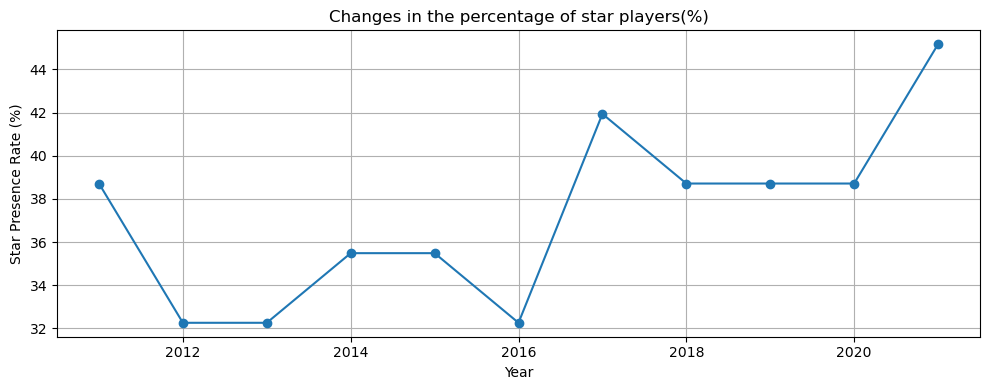
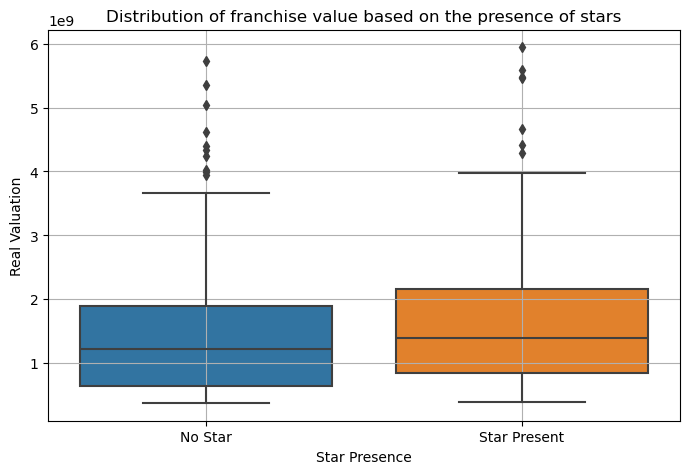
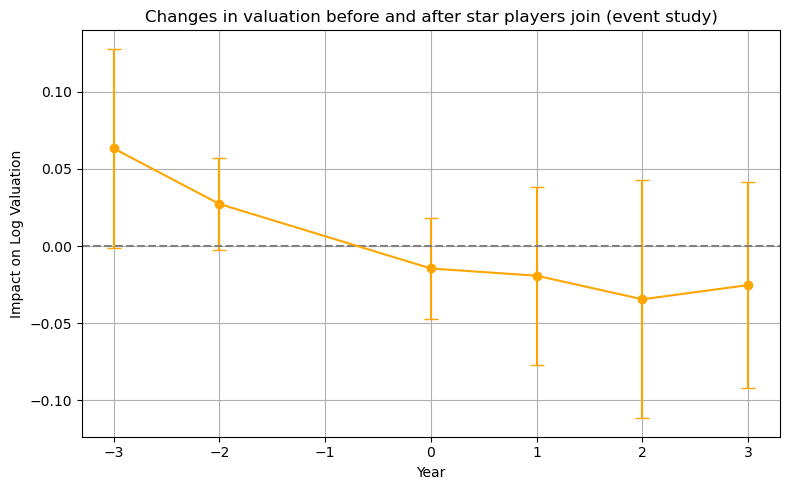

# Do Star Players Move the “Stock Price” of NBA Teams? ~DiD and Event Study: (3/3) The Analysis~

## 1. Introduction: Was It a Coincidence, or Something Real?

In this series, we've been tracking the relationship between star players and a team's enterprise value (Valuation).

In [(1/3) The Big Picture](https://shokubohcm.medium.com/do-star-players-move-the-stock-price-of-nba-teams-13166b3da4e7), we saw a league-wide trend where a star player's transfer coincided with a rise in team value.

In [(2/3) The Case Studies](https://shokubohcm.medium.com/do-star-players-move-the-stock-price-of-nba-teams-163c46237a49), we looked back at the stories behind specific moves, like those of LeBron and KD, along with the data.

Throughout this analysis, we repeatedly saw the phenomenon of a "star player's arrival boosting team value." But a question remained for me: "Can we really trust this 'star effect'?"

When we strip away other factors like the tailwind of the league's overall growth or a team's pre-existing popularity, what is the "net contribution" of a star player?

In this final installment, "The Analysis," I'll try to tackle this question with a statistical approach. Personally, I'm still learning about causal inference, but I wanted to try and get closer to the "net impact" of a star player's arrival on team value in my own way, using methods called "Difference-in-Differences (DiD)" and "Event Study."

## 2. The Blueprint for the Analysis: Data and Models

For this analysis, I used a total of 341 data points from all 30 NBA teams, spanning from 2011 to 2021.

> The reason for excluding data from 2022-2025 is that the valuation data for 2011-2021 was released in January/February, whereas for 2022-2025, it was released in October. For this analysis, which defines "star players" as All-NBA selections, the former dataset is more appropriate. I'm not entirely clear on this alignment myself, so I'd appreciate any feedback on this part. 🙇‍♂️

### Data Used (2011-2021, 341 obsevations)

- RealValuation (CPI-adjusted)
- StarPresence (Flag for presence)
- StarArrival (Flag for first year of arrival)
- NumStars (Count of stars)
- Dependent Variable: Log(Valuation) (Log-transformed real enterprise value)
- Explanatory Variables:
  - StarPresence: Whether a star player is on the team (1 or 0)
  - StarArrival: Whether it is the star's first year on the team (1 or 0)

The two main models used for the analysis were:

1. Basic Model (Difference-in-Differences: DiD):
$$log(Valuation)_{it}=\alpha+\beta \times StarPresence_{it} + FE_{team} + FE_{year} + \epsilon$$

2. Event Study Model:
This focuses on the "timing" of a star's arrival, tracking how the value changes over several years before and after the arrival (from k=-3 to k=+3 years).

## 3. A First Look at the Data (Exploratory Data Analysis)

Before diving into the main analysis, I got a general sense of the data.

### 3.1 Summary Statistics

| Variable | Mean | Std. Dev. | Min | Max |
| :--- | :--- | :--- | :--- | :--- |
| RealValuation (Billion $) | 1.58 | 1.10 | 0.37 | 5.95 |
| StarPresence (Flag) | 0.37 | 0.48 | 0 | 1 |
| StarArrival (Flag) | 0.13 | 0.34 | 0 | 1 |

(Table 1) Summary Statistics

During the period, the average enterprise value of an NBA team was about $1.6 billion. Star players were present on teams in about 37% of all team-year observations, and about 13% of those were the star's first year of arrival.

### 3.2 What's the percentage of Teams with a Star?

(Figure 1) Trend in the percentage of teams with a star player (%)

The percentage of teams with a star player fluctuates by year. You can see it jumps significantly in 2017 and 2021. I imagine this is due to factors like Kyrie going to the Celtics and Butler to the Wolves in 2017, and various teams having star players in 2021, like when Randle was selected for the All-NBA team from the Knicks.

### 3.3 Is There a Value Difference With or Without a Star?

(Figure 2) Distribution of enterprise value by presence of stars

Teams with a star (right) tend to have a higher median value than teams without one (left). However, what's noteworthy is the spread of the distributions. There are many teams with low value despite having a star, and many teams that boast a high value without one. At this point, we get a glimpse of the possibility that "**a star is not a silver bullet**".

## 4. Analysis Part 1: Does Simply Having a Star Raise Value?

Here is the analysis using the DiD model. I included team and year fixed effects to look only at the impact of a star's presence (StarPresence).

| Variable | Coefficient (β) | p-value |
| :--- | :--- | :--- |
| StarPresence | +0.022 | 0.201 |

(Table 2) Baseline Regression Results

To be honest, the result was surprising. The value increase from a star player's presence was small at +2.2%, and with a p-value of 0.201, the result was not "statistically significant."

Why is this? In this model, the inherent "brand value" of teams like the Lakers or the Knicks has already been removed by the team fixed effects. In other words, this result suggests that "after stripping out brand power and other factors, the net change in value during a star's tenure might not actually be that large."

## 5. Analysis Part 2: Is the Effect Different in the First Year vs. Later?

Next, I expanded the model slightly to look at the effects of the "first year of arrival" (StarArrival) and the "overall presence" (StarPresence) separately.

| Variable | Coefficient (β) | p-value |
| :--- | :--- | :--- |
| StarArrival | -0.060 | 0.008 |
| StarPresence | +0.048 | 0.038 |

(Table 3) Regression Results Separating Arrival and Presence

This is where a very interesting result emerged.

- First Year of Arrival (StarArrival): Enterprise value decreases by about 6.0%.
- Overall Presence (StarPresence): Enterprise value increases by about 4.8%.

And with both p-values below 0.05, these results are statistically significant.

This seems to support the hypothesis that "the market evaluates a star's arrival in three stages: rumor → discount → performance." In other words, in the first year, the high salary of the star player and the costs/uncertainty associated with reshaping the team are evaluated as a "discount" factor, temporarily lowering the value. However, from the second year onwards, as the star settles in and starts delivering results, the positive effects begin to outweigh the costs.

## 6. Analysis Part 3: Looking at the Timeline with an Event Study

Let's take a closer look at this "time-lagged evaluation" with an event study.

(Figure 3) Changes in valuation before and after star player arrival (event study)

This graph shows the change in value relative to the year of the star's arrival (Year=0).

- **Before Arrival (k=-3 to -1 year)**: The value is already on an upward trend. This suggests that the market prices in expectations early, during the "rumor" stage of a transfer.
- **Year of Arrival (k=0)**: In a reversal from the prior trend, the value drops. The "first-year discount" we saw in Analysis Part 2 was confirmed here as well.
- **After Arrival (k=1 to 3 years)**: The effect hovers around zero. This might mean that once the value has been priced in, the valuation enters a phase where it is judged based on actual "performance," such as team results and business developments.

## 7. Discussion and My Own Takeaways

Here’s a summary of what I felt and thought about based on these analysis results.

- **Surprising Points**:
  - **"Value Drop in the Arrival Year"**: I had assumed acquiring a star was unconditionally positive, but I was surprised by how smart the market is to immediately price in reinforcement costs and uncertainty.
  - **"The Weakness of the Presence Effect"**: It really hit home for me how important other business factors like a team's inherent brand power, win rate, and arena strategy are, more so than the mere presence of a star.
- **Business Implications**:
If I were in an FP&A role for a team, I think I could draw three strategic takeaways from these results:
  1. **Resilience to Reinforcement Costs**: A strong capital base and financial foundation are essential to absorb the short-term dip in value that comes with acquiring a star.
  2. **Monetization through Peripheral Businesses**: To maximize the star effect, the real challenge is how to connect it to peripheral businesses like the arena, merchandise, and broadcasting rights during the post-arrival "performance" phase.
  3. **"Rumor" Management**: If value rises in anticipation during the rumor stage, then managing information leaks and media strategy becomes an important tactic for controlling enterprise value.

  ## 8. Conclusion: "A Star Is Not a Magic Wand"

This long, three-part analysis now comes to a close. The final conclusion I've reached is this:

**A star player is not a "magic wand" that instantly changes a team's value.**

Rather, they are an extremely difficult "strategic asset" to handle, one that comes with significant costs and risks if managed incorrectly. To maximize their value, it's essential to have not just the star's individual power, but also the team's management strategy, financial strength, and steady efforts in brand building.

It made me realize once again that the NBA is not just a sports league, but a dynamic "battleground of brand value" where intangible assets collide.

I also feel these three articles exposed my own lack of knowledge in statistical analysis, immaturity in data handling, and shallow interpretation. I will continue to work hard and improve.

In particular, the part I struggled with the most was classifying which NBA players are stars and which are not. This time, I defined stars as players selected to an All-NBA team, but I feel there are still hurdles to a correct analysis, such as the fact that this standard differs for every fan, and that it doesn't align with the timeline of when this team value data is released.

Also, the StarArrival variable includes cases where a player on the same team went from non-star to star. Since players usually become stars gradually, it's expected that team value would also increase gradually. Therefore, for a more rigorous analysis, it would be necessary to distinguish between cases where a star arrives via free agency or a trade.

Thank you for staying with me until the end! I'd love to hear your opinions on this amateur analysis or any critiques like, "Have you thought about it this way?" Please feel free to reach out in the comments or on [LinkedIn](https://www.linkedin.com/in/shokubohcm/)!
