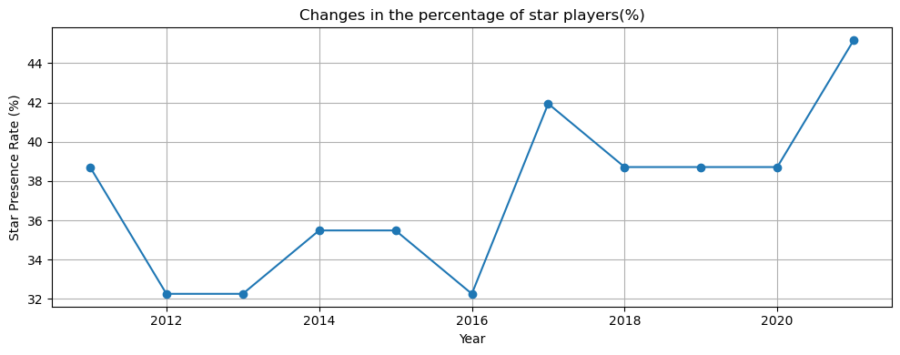
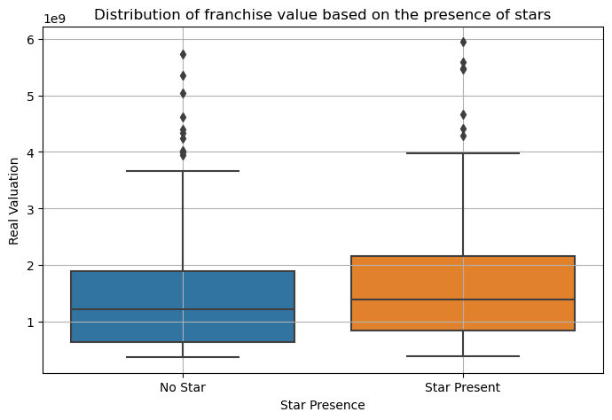
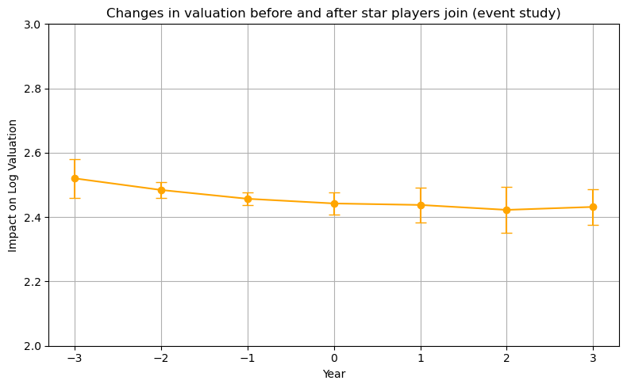

# スター選手はチームの“株価”を動かすのか?～DiDとイベントスタディ: (3/3) 分析編～

## 1. はじめに: 見えた現象は「偶然」か、それとも「本質」か?

このシリーズでは、スター選手とチームの企業価値（Valuation）の関係を追いかけてきました。

[(1/3) マクロ編](https://note.com/shokubohcm/n/n7bef1d17c2ca)では、リーグ全体でスター選手の移籍と価値上昇の間にトレンドがあることを見ました。

[(2/3) ケース編](https://note.com/shokubohcm/n/n2267570c06f9)では、レブロンやKDの移籍といった具体的な物語を、データと共に振り返りました。

これまでの分析で、「スター選手の加入は、チーム価値を押し上げる」という現象が何度も見られました。しかし、「この“スター効果”、本当に信じていいのだろうか?」という疑問がありました。

リーグ全体の成長という追い風や、チームが元々持っている人気など、他の要因を取り除いたとき、スター選手の「純粋な貢献度」はどれほど残るのでしょうか。

今回は最終回「分析編」として、この問いに統計的なアプローチで挑戦します。私自身、因果推論は勉強中の身ですが、「差分の差分法（DiD）」と「イベントスタディ」という手法を使い、スター選手の加入がチーム価値に与える「真水の影響」に、自分なりに迫ってみたいと思います。

## 2. 分析の設計図: データとモデル

今回の分析では、2011年から2021年までのNBA全30チーム、延べ341個のデータポイントを使用しました。

>2022-2025年のデータを除外した理由としては、2011-2021のデータの発表時期が1,2月であるのに対し、2022-2025年は10月に発表されており、All-NBA選手を"スター選手"とした本分析において、適切なのは前者のデータであるためです。ここの整合性も自分自身はっきり理解できていない部分があり、FB頂けると助かります🙇‍♂️

### 使用データ（2011–2021年、341観測）

- RealValuation（CPI調整後）
- StarPresence（在籍フラグ）
- StarArrival（加入初年度フラグ）
- NumStars（人数カウント）
- 目的変数: Log(Valuation)（対数をとった実質企業価値）
- 説明変数:
  - StarPresence: チームにスター選手が在籍しているか (1 or 0)
  - StarArrival: スター選手が加入した最初の年か (1 or 0)

そして、分析に用いたモデルは、主に以下の2つです。

1. 基本モデル（差分の差分法: DiD）:
$$log(Valuation)_{it}=\alpha+\beta \times StarPresence_{it} + FE_{team} + FE_{year} + \epsilon$$

2. イベントスタディモデル:
スター加入の「タイミング」に着目し、加入の前後数年（k=-3年から+3年）で価値がどう変動したかをより詳細に追跡します。

## 3. まずはデータを眺めてみる (探索的データ分析)

本格的な分析の前に、データの全体像を掴んでおきました。

### 3.1 データの要約

| 変数 | 平均 | 標準偏差 | 最小 | 最大 |
| :--- | :--- | :--- | :--- | :--- |
| RealValuation (Billion $) | 1.58 | 1.10 | 0.37 | 5.95 |
| StarPresence (Flag) | 0.37 | 0.48 | 0 | 1 |
| StarArrival (Flag) | 0.13 | 0.34 | 0 | 1 |

(表1) 要約統計量

期間中、NBAチームの平均企業価値は約16億ドル。全チーム・全年のうち**約37%でスター選手が在籍しており、そのうち約13%** が加入初年度でした。

### 3.2 スター選手がいるチームの割合は?

(図1) スター選手在籍チームの割合の推移 (%)

スター選手がいるチームの割合は、年によって変動しています。特に2017年と2021年に大きく跳ね上がっていることが分かります。
2017年のカイリーのセルティクス行きやバトラーのウルブズ行き、2021年はランドルがニックスからAll-NBAチームに選ばれたりと、様々なチームにスター選手が在籍したことがそれぞれ要因なのかなと想像しました。

### 3.3 スターの有無で価値は違う?

(図2) スター在籍の有無と企業価値の分布

スター在籍チーム（右）は、いないチーム（左）に比べて価値の中央値が高い傾向にあります。しかし、注目すべきは分布の広がりです。スターがいるにも関わらず価値が低いチームもあれば、いなくても高い価値を誇るチームも多数存在します。この時点で、**「スターは万能薬ではない」** という可能性が垣間見えます。

## 4. 分析①: スターがいるだけで価値は上がるのか?

DiDモデルを使った分析です。チームと年の固定効果を入れて、スター在籍（StarPresence）の影響だけを見てみます。

| 変数 | 係数 (β) | p値 |
| :--- | :--- | :--- |
| StarPresence | +0.022 | 0.201 |

(表2) ベースライン回帰の結果

結果は、正直なところ意外なものでした。スター選手が在籍することによる価値の上昇効果は **+2.2%** と小さく、さらにp値が0.201であり、「統計的に意味がある（確からしい）」とは言えない結果になりました。

これはなぜでしょうか。このモデルでは、レイカーズやニックスのようなチームが元々持つ「ブランド価値」は、チーム固定効果としてすでに取り除かれています。つまり、この結果が示しているのは、「ブランド力などを除いた上で、スターが在籍している間の純粋な価値変動は、実はそれほど大きくないかもしれない」という可能性があります。

## 5. 分析②: 「加入した年」と「それ以降」で効果は違う?

次に、モデルを少し拡張して、「加入1年目（StarArrival）」と「在籍期間全体（StarPresence）」の影響を分けて見てみました。

| 変数 | 係数 (β) | p値 |
| :--- | :--- | :--- |
| StarArrival | -0.060 | 0.008 |
| StarPresence | +0.048 | 0.038 |

(表3) 加入年と在籍期間を分けた回帰の結果

ここで、非常に興味深い結果が出てきました。

- 加入初年度 (StarArrival): 企業価値は約6.0%下落する。
- 在籍期間全体 (StarPresence): 企業価値は約4.8%上昇する。

そして、どちらもp値が0.05を下回っており、統計的にも意味のある結果です。

これは、「市場はスター加入を、噂→割引→実績の3段階で評価している」という仮説を裏付けているように思えます。つまり、加入初年度はスター選手の高額な年俸や、チーム再編に伴うコスト・不確実性が「割引」要因として評価され、一時的に価値が下がる。しかし、チームに定着し、実績を出し始める2年目以降は、プラスの効果が上回ってくる、という構造です。

## 6. 分析③: イベントスタディで時間の流れを見る

この「時間差の評価」を、イベントスタディでさらに詳しく見てみます。

(図3) スター選手加入前後の企業価値の変化（イベントスタディ）

このグラフは、スター加入年（Year=0）を基準とした価値の変動を示しています。

- 加入前 (k=-3～-1年): 価値はすでに上昇傾向にあります。これは、移籍の「噂」が飛び交う段階で、市場が期待を先行して織り込んでいることを示唆します。

- 加入年 (k=0): 直前までの上昇から一転、価値が下落しています。分析②で見た「加入初年度の割引」が、ここでも確認できました。

- 加入後 (k=1～3年): 効果はゼロ近辺で推移しています。これは、一度価値を織り込んだ後は、実際のチーム成績やビジネス展開といった「実績」で評価が判断されるフェーズに入ることを意味しているのかもしれません。

## 7. 考察と自分なりの示唆

今回の分析結果から、私が感じたこと、考えたことを整理します。

- **意外だった点**:
  - 「加入年の価値下落」: スター獲得は無条件にプラスだと思っていましたが、市場が補強コストや不確実性を即座に織り込むほどスマートであることに驚きました。
  - 「在籍効果の薄さ」: スターの存在そのものより、チームが元々持つブランド力や、勝率、アリーナ戦略といった他のビジネス要因がいかに重要かを痛感しました。
- **ビジネスへの示唆**:
もし自分がチームのFP&A担当者だったら、という視点で考えると、今回の結果から3つの戦略的示唆が得られそうです。
  1. 補強コストへの耐性: スター獲得に伴う短期的な価値下落を吸収できるだけの、強固な資本力や財務基盤が不可欠です。
  2. 周辺ビジネスでの収益化: スター効果を最大化するには、加入後の「実績」フェーズで、アリーナ、グッズ、放映権といった周辺ビジネスへといかに繋げるかが勝負です。
  3. 「噂」のマネジメント: 移籍の噂段階で価値が先行上昇するなら、情報リークやメディア戦略も、企業価値をコントロールする上での重要な戦術になります。

## 8. 結論: 「スターは魔法の杖ではない」

3回にわたる長い分析も、一旦これで終わりです。私が出した最終的な結論は、

**スター選手は、チームの価値を一瞬で変える「魔法の杖」ではない。**

ということです。

彼らはむしろ、使い方を間違えれば大きなコストとリスクを伴う、極めて扱いの難しい「戦略的資産」と言えるでしょう。その価値を最大限に引き出すには、スター個人の力だけでなく、チームの経営戦略、財務力、そしてブランド構築という地道な努力が不可欠です。

NBAは単なるスポーツリーグではなく、無形の資産がぶつかり合う、ダイナミックな「ブランド価値の格闘場」なのだと、改めて実感しました。

また、統計分析となったときの自身の知見のなさ、データ操作の未熟さ、解釈の浅さも露呈した3本だったと思います。これから精進していきます。

特に、NBAにおいてどの選手がスターで、どの選手がスターでないのかの分類に最もてこずりました。今回はAll-NBAに選出された選手をスターとしましたが、ファンごとにその基準が異なったり、そもそもこのチーム価値データが発表されるタイムラインと合っていないことなど、正しい分析にはまだハードルが残っているという印象です。

また、Stararrivalには、同チーム内で非スター→スターになった場合も含まれています。スター選手には、普通徐々になっていくものだから、チーム価値もじわじわと増えていくことが予想されるため、より厳密な分析のためには、FA,トレードでスターが来た場合との区別を行う必要があります。

最後までお付き合いいただき、ありがとうございました！この素人分析に対するご意見や、「こういう見方もあるのでは?」といったツッコミなど、ぜひコメントや[LinkedIn](https://www.linkedin.com/in/shokubohcm/)でお聞かせください！
